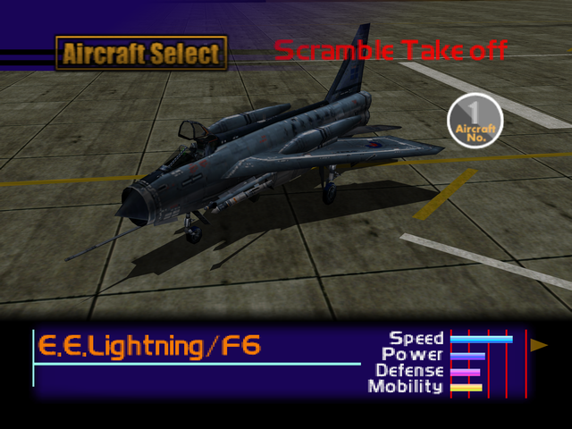

  

# Overview
<table class="aircraftOverview">
  <tr>
    <th>Price</th>
    <td>8,000,000</td>
  </tr>
  <tr>
    <th>Missile Capacity</th>
    <td>60</td>
  </tr>
</table>

# Availability
Complete the game on Hard difficulty, available on New Game+ OR shoot down the E.E. Lightning/F6 using guns on Mission 3: [Military Supply Base](/missions/m03-military-supply-base).

# Remark
Nothing more than a bragging rights reward for such arduous unlock requirement and pricetag, this vintage interceptor only serves as a sidegrade to [Kfir C.7](/aircraft/04_kfir_c7) at best with its near identical statistics.

# Encounter Locations

|Mission Name|Type|Quantity|
|-|-|-|
|[Military Supply Base](/missions/m03-military-supply-base)|Enemy - Unlockable|1|