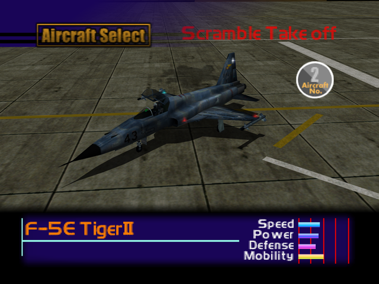

  

# Overview
<table class="aircraftOverview">
  <tr>
    <th>Price</th>
    <td>Free</td>
  </tr>
  <tr>
    <th>Missile Capacity</th>
    <td>60</td>
  </tr>
</table>

# Availability
Available from the start.

# Remark
Rather average overall as expected from a starter aircraft. While it can turn better than the MiG-21 and Kfir, its weak engine performance makes it difficult to win dogfight against faster adversaries.

This is the only aircraft that gets replaced for free of charge every time the player got shot down or crashed with it.

# Encounter Locations

|Mission Name|Type|Quantity|
|-|-|-|
|[Military Supply Base](/missions/m03-military-supply-base)|Enemy|1|
|[Oil Refinery Seizure](/missions/m10-oil-refinery-seizure)|Enemy|2|