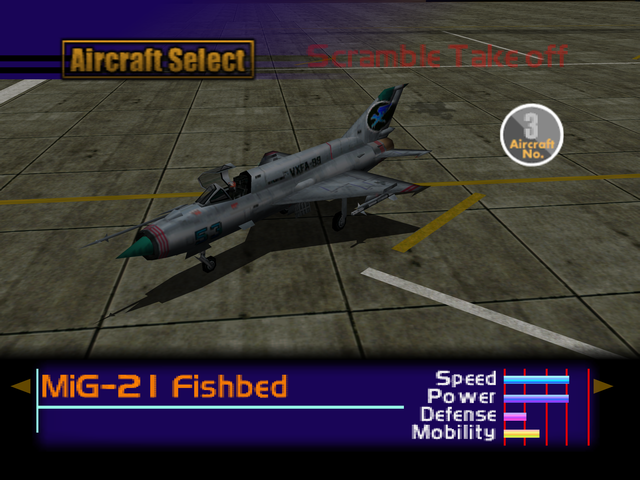

  

# Overview
<table class="aircraftOverview">
  <tr>
    <th>Price</th>
    <td>100,000</td>
  </tr>
  <tr>
    <th>Missile Capacity</th>
    <td>60</td>
  </tr>
</table>

# Availability
Complete Mission 1: [Home Air Defense](/missions/m01-home-air-defense).

# Remark
A fragile speed demon. It's top speed and explosive acceleration makes it an excellent pick for [Federation Fleet Obstruction](/missions/m02-federation-fleet-obstruction) due to its strict time limit and overwhelming enemy fighter presence.

# Encounter Locations
|Mission Name|Type|Quantity|
|-|-|-|
|[Military Supply Base](/missions/m03-military-supply-base)|Enemy|2|
|[Dogfight](/missions/m05-dogfight)|Target|1|
|[Escort Mission](/missions/m06-escort-mission)|Enemy|2|
|[POW Rescue](/missions/m08-pow-rescue)|Enemy|2|