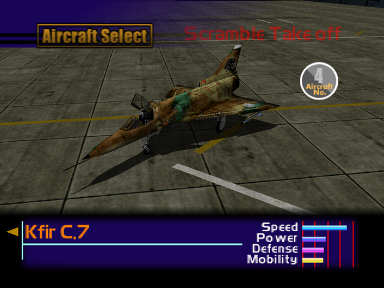

  

# Overview
<table class="aircraftOverview">
  <tr>
    <th>Price</th>
    <td>120,000</td>
  </tr>
  <tr>
    <th>Missile Capacity</th>
    <td>60</td>
  </tr>
</table>

# Availability
Complete Mission 1: [Home Air Defense](/missions/m01-home-air-defense).

# Remark
The Kfir boasts the fastest top speed of all aircraft available in the first two missions. However it comes at cost of below average acceleration and poor low speed handling.

# Encounter Locations
|Mission Name|Type|Quantity|
|-|-|-|
|[Military Supply Base](/missions/m03-military-supply-base)|Enemy|2|
|[Escort Mission](/missions/m06-escort-mission)|Enemy|2|