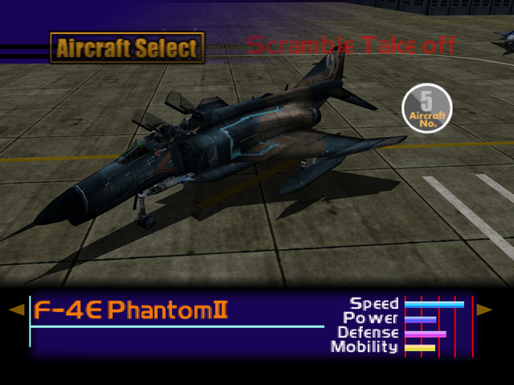

  

# Overview
<table class="aircraftOverview">
  <tr>
    <th>Price</th>
    <td>200,000</td>
  </tr>
  <tr>
    <th>Missile Capacity</th>
    <td>70</td>
  </tr>
</table>

# Availability
Complete Mission 2: [Federation Fleet Obstruction](/missions/m02-federation-fleet-obstruction).

# Remark
A large fighter with decent stats and modest acceleration. High durability offsets its rather sluggish handling.

# Encounter Locations
|Mission Name|Type|Quantity|
|-|-|-|
|[Military Supply Base](/missions/m03-military-supply-base)|Enemy|2|
|[Dogfight](/missions/m05-dogfight)|Enemy|5|
|[POW Rescue](/missions/m08-pow-rescue)|Enemy|4|