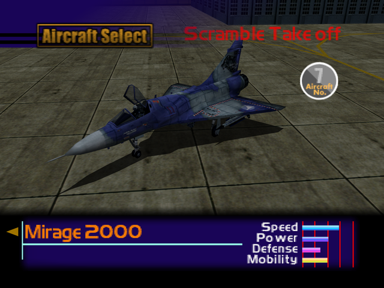

  

# Overview
<table class="aircraftOverview">
  <tr>
    <th>Price</th>
    <td>180,000</td>
  </tr>
  <tr>
    <th>Missile Capacity</th>
    <td>65</td>
  </tr>
</table>

# Availability
Complete Mission 2: [Federation Fleet Obstruction](/missions/m02-federation-fleet-obstruction).

# Remark
Fast and nimble delta wing fighter. A direct upgrade to the early game light fighters the player had access to in the first two missions.

# Encounter Locations
|Mission Name|Type|Quantity|
|-|-|-|
|[Home Air Defense](/missions/m01-home-air-defense)|Enemy|1|
|[Nuclear Transport Blockade](/missions/m09-nuclear-transport-blockade)|Enemy|2|