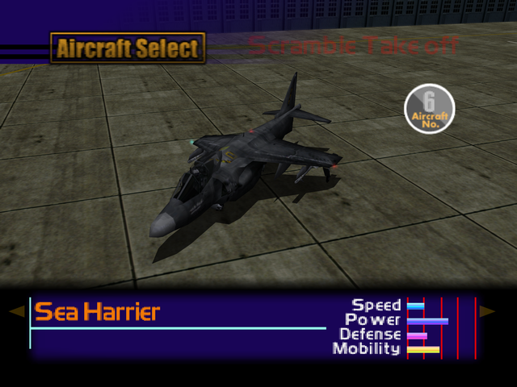

  

# Overview
<table class="aircraftOverview">
  <tr>
    <th>Price</th>
    <td>6,200,000</td>
  </tr>
  <tr>
    <th>Missile Capacity</th>
    <td>60</td>
  </tr>
</table>

# Availability
Complete the game on any difficulty, available on New Game+.

# Remark
One of the VTOL aircraft available for purchase on New Game+. The Sea Harrier has VTOL ability, allowing it to fly at extremely low stall speed, allows it to trivialize certain part of the game.

Despite its below average stats, this aircraft possesses abnormally high and responsive roll rate which also make it a surprisingly competent dogfighter

# Encounter Locations
|Mission Name|Type|Quantity|
|-|-|-|
|[Federation Fleet Obstruction](/missions/m02-federation-fleet-obstruction)|Enemy|1|