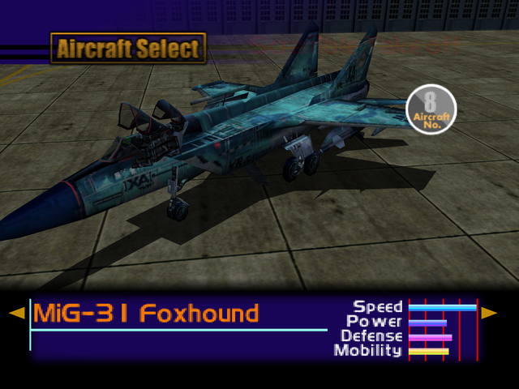

  

# Overview
<table class="aircraftOverview">
  <tr>
    <th>Price</th>
    <td>280,000</td>
  </tr>
  <tr>
    <th>Missile Capacity</th>
    <td>70</td>
  </tr>
</table>

# Availability
Complete Mission 3: [Military Supply Base](/missions/m03-military-supply-base).

# Remark
The fastest playable aircraft in the game, which makes it almost mandatory for high speed intercept mission such as [High Velocity Recon Plane](/missions/m04-high-velocity-recon-plane).

# Encounter Locations
|Mission Name|Type|Quantity|
|-|-|-|
|[High Velocity Recon Planes](/missions/m04-high-velocity-recon-planes)|Enemy|2|
|[The Ice Floe Base](/missions/m15-the-ice-floe-base)|Enemy|2|