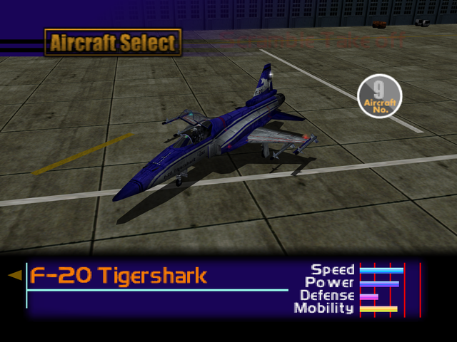

  

# Overview
<table class="aircraftOverview">
  <tr>
    <th>Price</th>
    <td>300,000</td>
  </tr>
  <tr>
    <th>Missile Capacity</th>
    <td>60</td>
  </tr>
</table>

# Availability
Complete Mission 3: [Military Supply Base](/missions/m03-military-supply-base).

# Remark
A straight upgrade from the <a href="../aircraft/02_f-5e">F-5E Tiger II</a>. A very maneuverable dogfighter with limited survivability and missile capacity. Best used for air-to-air missions with few number of enemies.

# Encounter Locations
|Mission Name|Type|Quantity|
|-|-|-|
|[Dogfight](/missions/m05-dogfight)|Target|1|
|[Escort Mission](/missions/m06-escort-mission)|Enemy|2|
|[Ceasefire Conference Security](/missions/m11-ceasefire-conference-security)|Target|1|
|[The Mountain Base](/missions/m16-the-mountain-base)|Enemy|2|