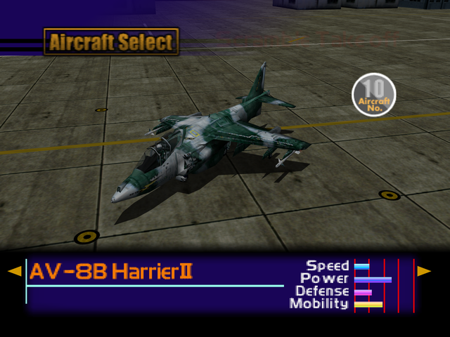

  

# Overview
<table class="aircraftOverview">
  <tr>
    <th>Price</th>
    <td>6,000,000</td>
  </tr>
  <tr>
    <th>Missile Capacity</th>
    <td>60</td>
  </tr>
</table>

# Availability
Complete the game on any difficulty, available on New Game+.

# Remark
One of the VTOL aircraft available for purchase on New Game+. A sidegrade to the [Sea Harrier](/aircraft/07_sea-harrier) with unsually drifty flight physics, which technically allows the player to outmaneuver virtually every enemy aircraft in the game.

# Encounter Locations
|Mission Name|Type|Quantity|
|-|-|-|
|[The Silvan Fortress](/missions/m12-the-silvan-fortress)|Enemy|2|