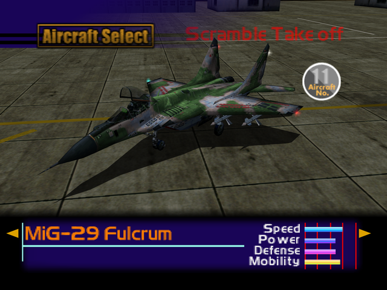

  

# Overview
<table class="aircraftOverview">
  <tr>
    <th>Price</th>
    <td>220,000</td>
  </tr>
  <tr>
    <th>Missile Capacity</th>
    <td>65</td>
  </tr>
</table>

# Availability
Complete Mission 4: [High Velocity Recon Plane](/missions/m04-high-velocity-recon-plane).

# Remark
Well rounded and capable dogfighter. The MiG-29 is an ideal early game choice until lategame aircraft are available. Compared to the [F-16 Fighting Falcon](/aircraft/12_f-16) this one is better suited for air-to-air missions.

# Encounter Locations

|Mission Name|Type|Quantity|
|-|-|-|
|[Dogfight](/missions/m05-dogfight)|Target|1|
|[Nuclear Transport Blockade](/missions/m09-nuclear-transport-blockade)|Enemy|2|
|[The Fort Base](/missions/m13-the-fort-base)|Target|1|
|[The Island Fortress](/missions/m18-the-island-fortress)|Enemy|2|