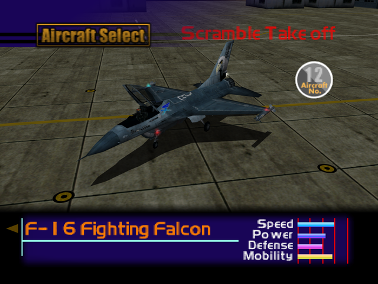

  

# Overview
<table class="aircraftOverview">
  <tr>
    <th>Price</th>
    <td>260,000</td>
  </tr>
  <tr>
    <th>Missile Capacity</th>
    <td>70</td>
  </tr>
</table>

# Availability
Complete Mission 4: [High Velocity Recon Plane](/missions/m04-high-velocity-recon-plane).

# Remark
Almost a direct sidegrade to the [MiG-29 Fulcrum](/aircraft/11_mig-29), trading slight acceleration and defense for higher missile capacity and slightly better maneuverability. Extra missiles makes it better suited for air to ground or other larger scale missions than the MiG-29.

# Encounter Locations
|Mission Name|Type|Quantity|
|-|-|-|
|[Home Air Defense](/missions/m01-home-air-defense)|Enemy|1|
|[High Velocity Recon Plane](/missions/m04-high-velocity-recon-plane)|Enemy|2|
|[Oil Refinery Seizure](/missions/m10-oil-refinery-seizure)|Enemy|2|