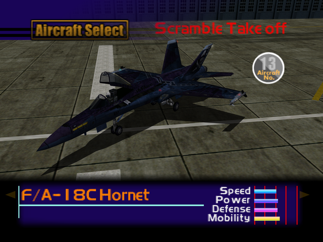

  

# Overview
<table class="aircraftOverview">
  <tr>
    <th>Price</th>
    <td>300,000</td>
  </tr>
  <tr>
    <th>Missile Capacity</th>
    <td>70</td>
  </tr>
</table>

# Availability
Complete the game on any difficulty, available on New Game+.

# Remark
An average fighter whose performance is slight downgrade from [F/A-18E Super Hornet](/aircraft/14_fa-18e) in every way, it's only saving grace is being the least expensive unlockable aircraft unlocked on New Game+.

# Encounter Locations
|Mission Name|Type|Quantity|
|-|-|-|
|[Federation Fleet Obstruction](/missions/m02-federation-fleet-obstruction)|Enemy|1|
|[The Ice Floe Base](/missions/m15-the-ice-floe-base)|Enemy|2|
|[Mobile Infantry](/missions/m17-mobileinfantry)|Enemy|2|