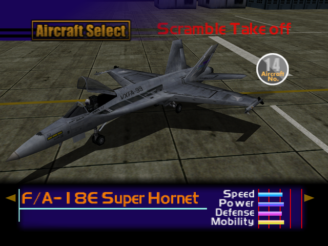

  

# Overview
<table class="aircraftOverview">
  <tr>
    <th>Price</th>
    <td>320,000</td>
  </tr>
  <tr>
    <th>Missile Capacity</th>
    <td>75</td>
  </tr>
</table>

# Availability
Complete Mission 5: [Dogfight](/missions/m05-dogfight).

# Remark
Another aircraft with balanced stats, it's abundant missile capacity and high defense makes it effective at air-to-ground missions. A much more generalized choice compared to [MiG-29 Fulcrum](/aircraft/11_mig-29) or [F-16 Fighting Falcon](/aircraft/12_f-16).

This is the only playable aircraft in the game not operated by the enemy forces.