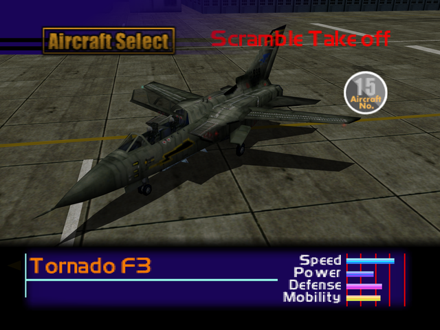

  

# Overview
<table class="aircraftOverview">
  <tr>
    <th>Price</th>
    <td>300,000</td>
  </tr>
  <tr>
    <th>Missile Capacity</th>
    <td>70</td>
  </tr>
</table>

# Availability
Complete Mission 6: [Escort Mission](/missions/m06-escort-mission).

# Remark
High speed interceptor with high durability. Despite its rather average mobility, the Tornado possesses surprisingly good low speed handling which makes it a good choice for dogfight.

# Encounter Locations
|Mission Name|Type|Quantity|
|-|-|-|
|[Oil Refinery Seizure](/missions/m10-oil-refinery-seizure)|Enemy|1|
|[The Fort Base](/missions/m13-the-fort-base)|Enemy|2|