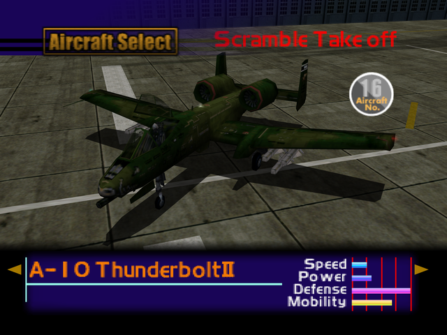

  

# Overview
<table class="aircraftOverview">
  <tr>
    <th>Price</th>
    <td>180,000</td>
  </tr>
  <tr>
    <th>Missile Capacity</th>
    <td>90</td>
  </tr>
</table>

# Availability
Complete Mission 7: [Gorge Base](/missions/m07-gorge-base).

# Remark
The vernerable Warthog boasts the highest missile capacity and defense of all playable aircraft, while also having respectable maneuverability. Its dogfight potential is hampered by abysmal top speed which makes it difficult to keep up with faster jets.

# Encounter Locations
|Mission Name|Type|Quantity|
|-|-|-|
|[Nuclear Transport Blockade](/missions/m09-nuclear-transport-blockade)|Enemy|2|
|[Oil Refinery Seizure](/missions/m10-oil-refinery-seizure)|Enemy|2|