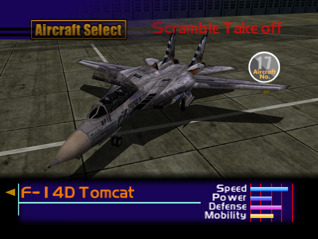

  

# Overview
<table class="aircraftOverview">
  <tr>
    <th>Price</th>
    <td>180,000</td>
  </tr>
  <tr>
    <th>Missile Capacity</th>
    <td>75</td>
  </tr>
</table>

# Availability
Complete Mission 8: [POW Rescue](/missions/m08-pow-rescue).

# Remark
A fast interceptor whose performance sits in the middle ground between the [MiG-31 Foxhound](/aircraft/08_mig-31) and [Tornado F3](/aircraft/15_tornado_f3). While it's not as fast as the former, it doesn't turn as well as the Tornado either. To compensate its inferior flight performance, it can withstand more punishment compared to both aforementioned planes.

# Encounter Locations
|Mission Name|Type|Quantity|
|-|-|-|
|[Federation Fleet Obstruction](/missions/m02-federation-fleet-obstruction)|Enemy|2|
|[Escort Mission](/missions/m06-escort-mission)|Enemy|2|
|[The True Island Fortress](/missions/m19-the-true-island-fortress)|Enemy|2|