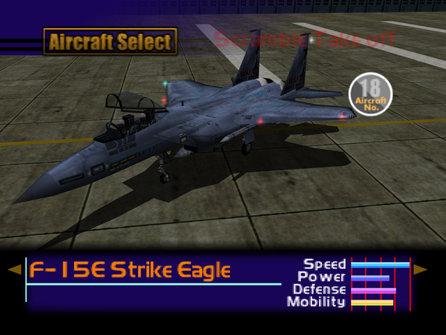

  

# Overview
<table class="aircraftOverview">
  <tr>
    <th>Price</th>
    <td>470,000</td>
  </tr>
  <tr>
    <th>Missile Capacity</th>
    <td>85</td>
  </tr>
</table>

# Availability
Complete the game on any difficulty, available on New Game+.

# Remark
An excellent sidegrade to the [F-15S/MT Active](/aircraft/21_f-15sactive) that trades slight maneuverability for higher speed, defense and missile capacity.

# Encounter Locations
|Mission Name|Type|Quantity|
|-|-|-|
|[Home Air Defense](/missions/m01-home-air-defense)|Enemy|1|