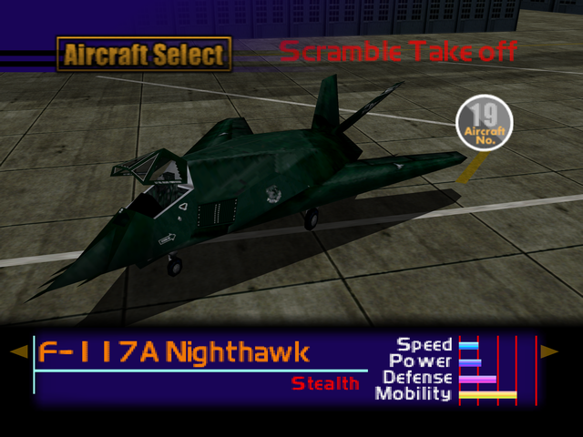

  

# Overview
<table class="aircraftOverview">
  <tr>
    <th>Price</th>
    <td>480,000</td>
  </tr>
  <tr>
    <th>Missile Capacity</th>
    <td>60</td>
  </tr>
</table>

# Availability
Complete Mission 9: [Nuclear Transport Blockade](/missions/m09-nuclear-transport-blockade).

# Remark
This stealth fighter shares similar flight characteristics that to the [A-10 Thunderbolt II](/aircraft/16_a-10), with much smaller missile capacity and lower durability in exchange to stealth, which reduces the range in which enemies can lock on at the player.

# Encounter Locations
|Mission Name|Type|Quantity|
|-|-|-|
|[The Mountain Base](/missions/m16-the-mountain-base)|Enemy|2|
|[Mobile Infantry](/missions/m17-mobile-infantry)|Enemy|2|