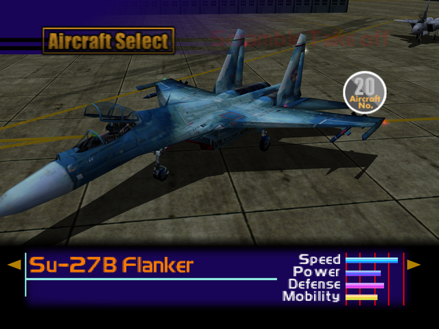

  

# Overview
<table class="aircraftOverview">
  <tr>
    <th>Price</th>
    <td>320,000</td>
  </tr>
  <tr>
    <th>Missile Capacity</th>
    <td>75</td>
  </tr>
</table>

# Availability
Complete the game on any difficulty, available on New Game+.

# Remark
A mid-game tier Flanker variant with emphasis on speed. Actual performance is about on par with [F-14D Tomcat](/aircraft/17_f-14d).

# Encounter Locations
|Mission Name|Type|Quantity|
|-|-|-|
|[Ceasefire Conference Security](/missions/m11-ceasefire-conference-security)|Enemy|2|
|[The Fort Base](/missions/m13-the-fort-base)|Enemy|2|
|[The Island Fortress](/missions/m18-the-island-fortress)|Enemy|2|