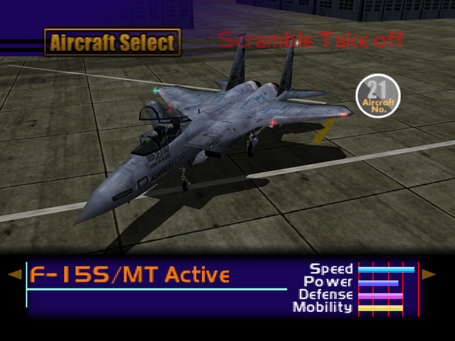

  

# Overview
<table class="aircraftOverview">
  <tr>
    <th>Price</th>
    <td>700,000</td>
  </tr>
  <tr>
    <th>Missile Capacity</th>
    <td>80</td>
  </tr>
</table>

# Availability
Complete Mission 9: [Nuclear Transport Blockade](/missions/m09-nuclear-transport-blockade).

# Remark
A superb all rounder fighter packed with top class speed and maneuverability, which only can be surpassed by endgame aircraft.

# Encounter Locations
|Mission Name|Type|Quantity|
|-|-|-|
|[Satellite Intercept Mission](/missions/m14-satellite-intercept-mission)|Enemy|2|