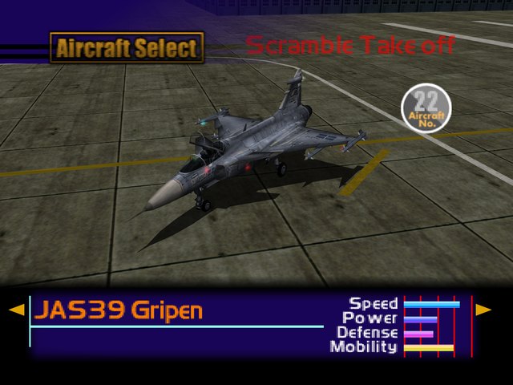

  

# Overview
<table class="aircraftOverview">
  <tr>
    <th>Price</th>
    <td>380,000</td>
  </tr>
  <tr>
    <th>Missile Capacity</th>
    <td>65</td>
  </tr>
</table>

# Availability
Complete Mission 10: [Oil Refinery Seizure](/missions/m10-oil-refinery-seizure).

# Remark
Light fighter with exceptional maneuverability. Unfortunately it's handicapped by low payload, poor durability. It has inherent high stall speed like other delta wing aircraft in this game, which makes low speed maneuvering difficult thnaks to its below average acceleration.

# Encounter Locations
|Mission Name|Type|Quantity|
|-|-|-|
|[Dogfight](/missions/m05-dogfight)|Target|1|
|[Ceasefire Conference Security](/missions/m11-ceasefire-conference-security)|Enemy|2|
|[The Ice Floe Base](/missions/m15-the-ice-floe-base)|Enemy|2|
|[The Mountain Base](/missions/m16-the-mountain-base)|Target|1|
|[The True Island Fortress](/missions/m19-the-true-island-fortress)|Enemy|2|