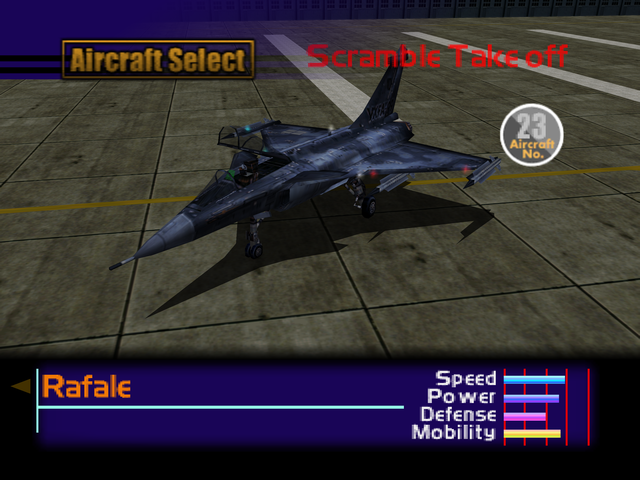

  

# Overview
<table class="aircraftOverview">
  <tr>
    <th>Price</th>
    <td>420,000</td>
  </tr>
  <tr>
    <th>Missile Capacity</th>
    <td>75</td>
  </tr>
</table>

# Availability
Complete Mission 11: [Ceasefire Conference Security](/missions/m11-ceasefire-conference-security).

# Remark
A balanced alternative to the [JAS39 Gripen](/aircraft/22_jas39) and [EF2000 Typhoon](/aircraft/24_ef2000), the Rafale has superior acceleration and defense compared to the former but worse maneuverability and top speed.

# Encounter Locations
|Mission Name|Type|Quantity|
|-|-|-|
|[Federation Fleet Obstruction](/missions/m02-federation-fleet-obstruction)|Enemy|2|
|[The Silvan Fortress](/missions/m12-the-silvan-fortress)|Enemy|4|