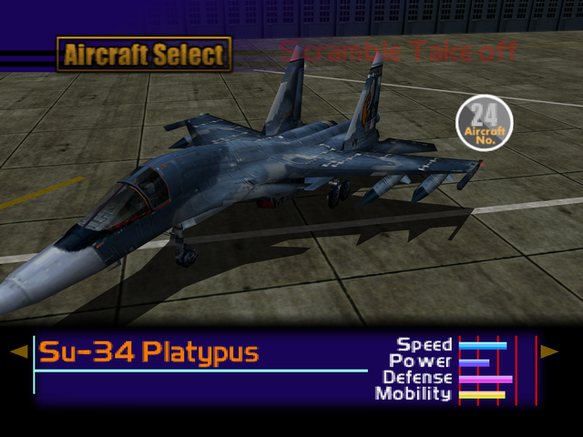

  

# Overview
<table class="aircraftOverview">
  <tr>
    <th>Price</th>
    <td>340,000</td>
  </tr>
  <tr>
    <th>Missile Capacity</th>
    <td>85</td>
  </tr>
</table>

# Availability
Complete the game on any difficulty, available on New Game+.

# Remark
Despite its sluggish handling, the Platypus boasts unique missile that deals roughly 1.5 times more damage than normal missile, which makes it perfect for missions with many tough ground targets.

# Encounter Locations
|Mission Name|Type|Quantity|
|-|-|-|
|[Federation Fleet Obstruction](/missions/m02-federation-fleet-obstruction)|Enemy|1|
|[Mobile Infantry](/missions/m17-mobile-infantry)|Enemy|1|