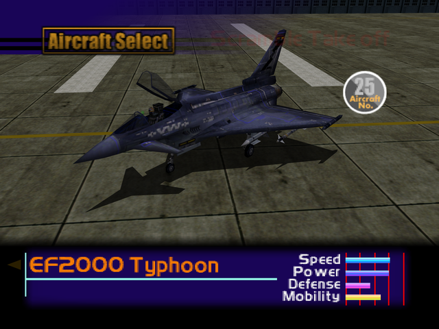

  

# Overview
<table class="aircraftOverview">
  <tr>
    <th>Price</th>
    <td>480,000</td>
  </tr>
  <tr>
    <th>Missile Capacity</th>
    <td>75</td>
  </tr>
</table>

# Availability
Complete Mission 12: [The Silvan Fortress](/missions/m12-the-silvan-fortress).

# Remark
Of all three playable Eurocanards, the Typhoon has the acceleration but the weakest maneuverability which makes it more suitable for hit and run tactics. Thanks to its high acceleration, it recovers from stalling much faster and easier than other delta wing fighters.

# Encounter Locations
|Mission Name|Type|Quantity|
|-|-|-|
|[High Velocity Recon Plane](/missions/m04-high-velocity-recon-plane)|Enemy|2|
|[Ceasefire Conference Security](/missions/m11-ceasefire-conference-security)|Enemy|2|
|[The Ice Floe Base](/missions/m15-the-ice-floe-base)|Enemy|2|