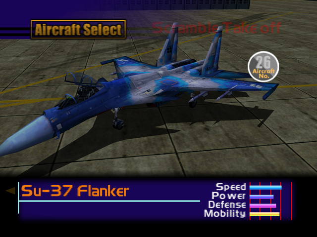

  

# Overview
<table class="aircraftOverview">
  <tr>
    <th>Price</th>
    <td>500,000</td>
  </tr>
  <tr>
    <th>Missile Capacity</th>
    <td>80</td>
  </tr>
</table>

# Availability
Complete Mission 13: [The Fort Base](/missions/m13-the-fort-base).

# Remark
A slightly inferior alternative to the [F-15S/MT Active](/aircraft/21_f-15sactive), otherwise it has similar flight performance but with worse durability.

# Encounter Locations
|Mission Name|Type|Quantity|
|-|-|-|
|[The Ice Floe Base](/missions/m15-the-ice-floe-base)|Enemy|2|
|[The Island Fortress](/missions/m18-the-island-fortress)|Enemy|2|