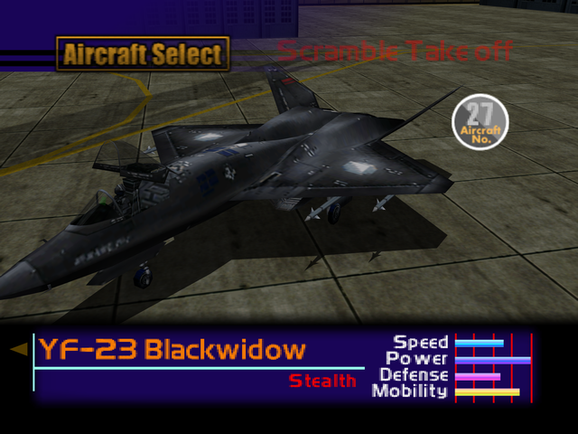

  

# Overview
<table class="aircraftOverview">
  <tr>
    <th>Price</th>
    <td>650,000</td>
  </tr>
  <tr>
    <th>Missile Capacity</th>
    <td>75</td>
  </tr>
</table>

# Availability
Complete Mission 14: [Satellite Intercept Mission](/missions/m14-satellite-intercept-mission).

# Remark
Exceptionally fast stealth fighter with snappy handling, only limited by below average durability. At best a sidegrade to the [S-37 Berkut](/aircraft/28_s-37) with emphasis on acceleration. 

# Encounter Locations
|Mission Name|Type|Quantity|
|-|-|-|
|[The Silvan Fortress](/missions/m12-the-silvan-fortress)|Enemy|4|
|[The Mountain Base](/missions/m16-the-mountain-base)|Enemy|2|
|[The True Island Fortress](/missions/m19-the-true-island-fortress)|Enemy|2|