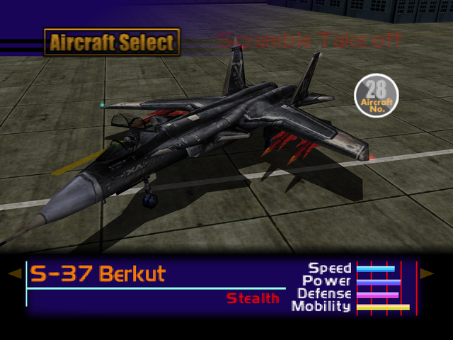

  

# Overview
<table class="aircraftOverview">
  <tr>
    <th>Price</th>
    <td>800,000</td>
  </tr>
  <tr>
    <th>Missile Capacity</th>
    <td>75</td>
  </tr>
</table>

# Availability
Complete the game on Easy difficulty or higher, available on New Game+ OR shoot down the S-37 Berkut using guns at Mission 17: [Mobile Infantry](/missions/m17-mobile-infantry).

# Remark
A superb sidegrade to the [F-22 Raptor](/aircraft/29_f-22) which normally requires game completion to unlock, unless if the certain S-37 is shot down using guns on Mission 17: [Mobile Infantry](/missions/m17-mobile-infantry).

Compared to the F-22 it has slightly inferior overall performance, but in exchange it has the highest low speed maneuverability among all non-VTOL aicraft, which makes it perfect choice for every air-to-air focused mission.

# Encounter Locations
|Mission Name|Type|Quantity|
|-|-|-|
|[Mobile Infantry](/missions/m17-mobile-infantry)|Target - Unlockable|1|
|[The Island Fortress](/missions/m18-the-island-fortress)|Enemy|2|