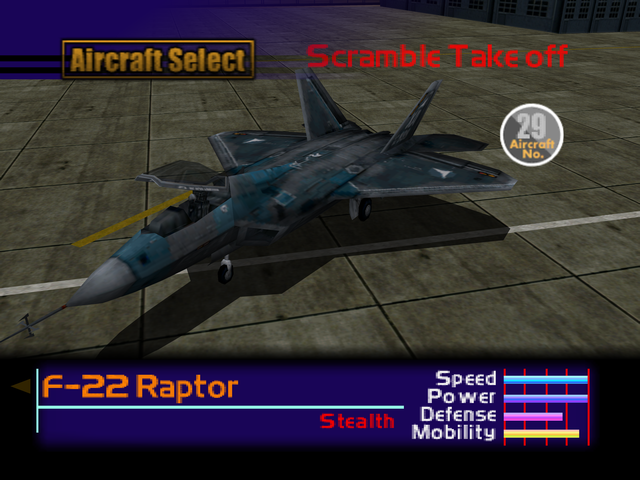

  

# Overview
<table class="aircraftOverview">
  <tr>
    <th>Price</th>
    <td>600,000</td>
  </tr>
  <tr>
    <th>Missile Capacity</th>
    <td>80</td>
  </tr>
</table>

# Availability
Complete Mission 15: [The Ice Floe Base](/missions/m15_the-ice-floe-base).

# Remark
The premier ultimate fighter one can afford before New Game+, the Raptor boasts unrivaled stats even surpasses that of the secret unlockable [S-37 Berkut](/aircraft/28_s-37) and [MiG-1.44 MFI](/aircraft/31_mig-144).

# Encounter Locations
|Mission Name|Type|Quantity|
|-|-|-|
|[Dogfight](/missions/m05-dogfight)|Target|1|
|[The Fort Base](/missions/m13-the-fort-base)|Enemy|2|
|[The Mountain Base](/missions/m16-the-mountain-base)|Enemy|2|
|[The True Island Fortress](/missions/m19-the-true-island-fortress)|Enemy|2|
|[The True Island Fortress](/missions/m19-the-true-island-fortress)|Target|1|