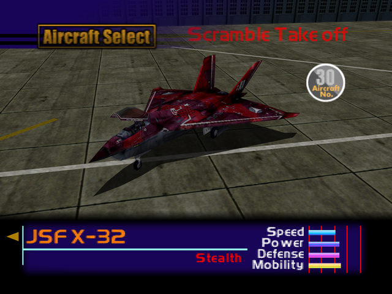

  

# Overview
<table class="aircraftOverview">
  <tr>
    <th>Price</th>
    <td>550,000</td>
  </tr>
  <tr>
    <th>Missile Capacity</th>
    <td>70</td>
  </tr>
</table>

# Availability
Complete Mission 16: [The Mountain Base](/missions/m16_the-mountain-base).

# Remark
Behind its very belated unlock condition and underwhelmingly average overall performance, the X-32 is the only playable stealth aircraft in the game capable to perform pseudo-VTOL with its very low stall speed, but not as low as the Harriers unlocked on New Game+.

# Encounter Locations
|Mission Name|Type|Quantity|
|-|-|-|
|[The Fort Base](/missions/m13-the-fort-base)|Enemy|2|
|[The True Island Fortress](/missions/m19-the-true-island-fortress)|Enemy|2|