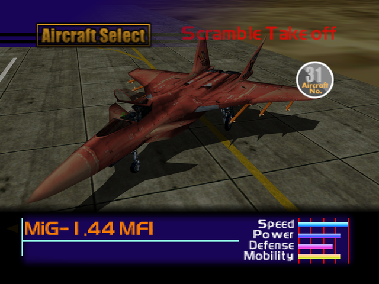

  

# Overview
<table class="aircraftOverview">
  <tr>
    <th>Price</th>
    <td>5,000,000</td>
  </tr>
  <tr>
    <th>Missile Capacity</th>
    <td>85</td>
  </tr>
</table>

# Availability
Complete the game on Normal difficulty or higher, available on New Game+ OR shoot down the MiG-1.44 MFI using guns on Mission 20: [The Confrontation](/missions/m20-the-confrontation).

# Remark
As expected for the true final boss aircraft, this aircraft can outrun and outturn all enemies with ease. Compared to other endgame aircraft it can carry more missiles as the advantage.

# Encounter Locations
|Mission Name|Type|Quantity|
|-|-|-|
|[The Confrontation](/missions/m20-the-confrontation)|Target - Unlockable|1|