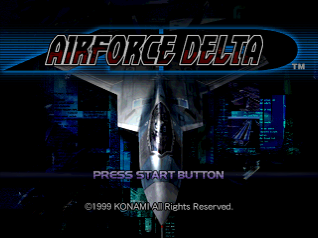
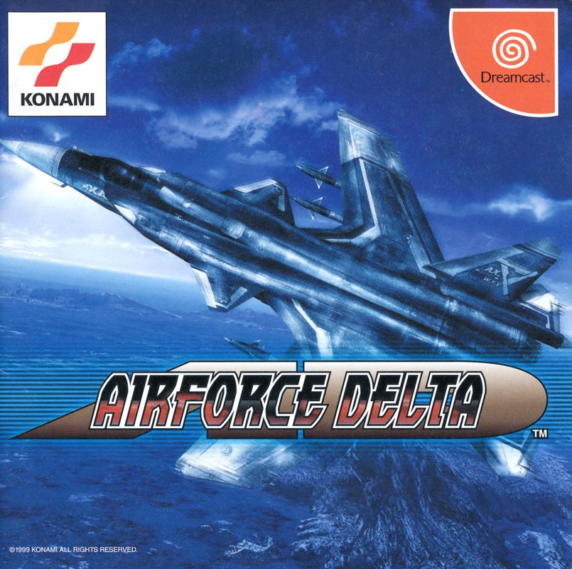
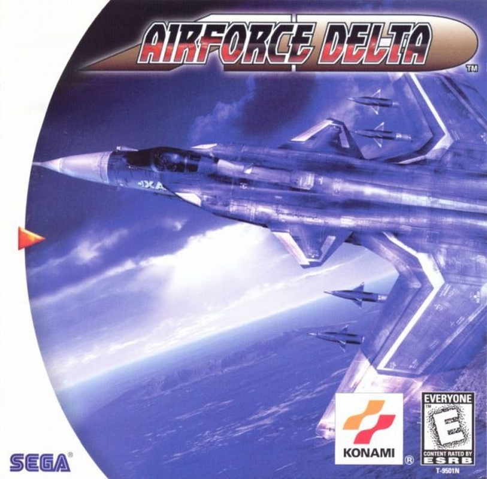
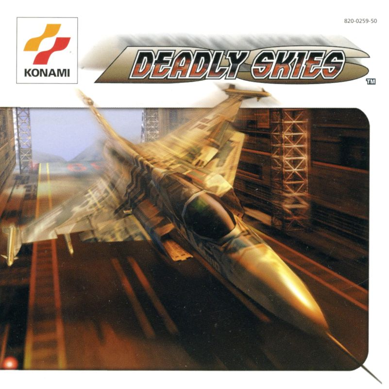

  

This is a strategy guide wiki for Airforce Delta (known as Deadly Skies in Europe)  by Konami. 

This wiki mainly focuses on gameplay and strategy guides therefore it's not intended as an replacement for Airforce Delta Wikia (https://airforce-delta.fandom.com/wiki/Airforce_Delta_Wikia)

<table>
  <tr>
    <th>Platform</th>
    <th colspan="3">Sega Dreamcast</th>
  </tr>
  <tr>
    <td>Release Date</td>
    <td>Japan: July 29th, 1999</td>
    <td>USA: September 9th, 1999</td>
    <td>Europe: February 18th, 2000</td>
  </tr>
  <tr>
    <td>Publisher</td>
    <td colspan="3">Konami</td>
  </tr>
  <tr>
    <td>Developer</td>
    <td colspan="3">Konami Computer Entertainment Yokohama</td>
  </tr>
  <tr>
    <td>Box Art</td>
    <td class ="tableImage"></td>
    <td class ="tableImage"></td>
    <td class ="tableImage"></td>
  </tr>
</table>

