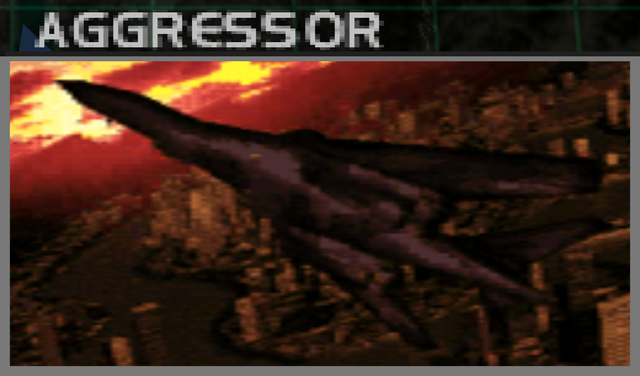
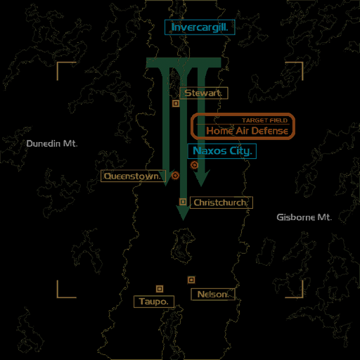
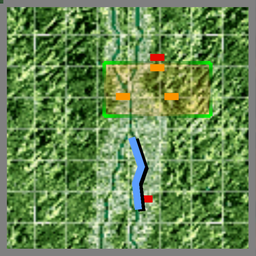

# Mission Data 

<table id="targetList" class="pageLinksTable">
  <tr>
    <td class ="tableImage" colspan="2"></td>
  </tr>
  <tr>
    <td>Location</td>
    <td>Naxos City</td>
  </tr>
  <tr>
    <td>Objective</td>
    <td>Shoot down all enemy bombers</td>
  </tr>
  <tr>
    <td>Time Limit</td>
    <td>10 Minutes</td>
  </tr>
  <tr>
    <td>Time of Day</td>
    <td>Dusk</td>
  </tr>
</table>

# Briefing

  

Multiple unmarked fighters presumed to be People's Federation Air Force crafts are on an incoming course heading towards the Delta Base.
Your mission is to target this air squadron, presumed a People's Federation Air Force strike team, for elimination.
The enemy is most likely a squadron of large bombers on a bombing raid of our base.
You are to carry out a preemptive assault. 

# Mission Map

  

# Enemy List

|Name|Type|Quantity|Score|
|-|-|-|-|
|B-1B|Target - Air|3|67,500|
|[Mirage-2000](/aircraft/06_mirage-2000)|Enemy - Air|1|34,000|
|[F-16 Fighting Falcon](/aircraft/12_f-16)|Enemy - Air|1|39,000|
|[F-15E Strike Eagle](/aircraft/18_f-15e)|Enemy - Air|1|50,000|

# Unlock Reward
- [MiG-21 Fishbed](/aircraft/03_mig-21)
- [Kfir C.7](/aircraft/04_kfir_c7)

# Mission Guide
A typical bomber intercept first mission as per genre tradition. Two B-1Bs are located right in front of player starting point. The last B-1B is flying from the opposite direction of the player escorted by an F-15E. The F-15E may pose considerable threat on Hard difficulty as it's very maneuverable and durable.