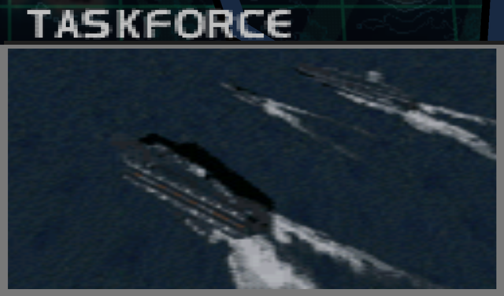
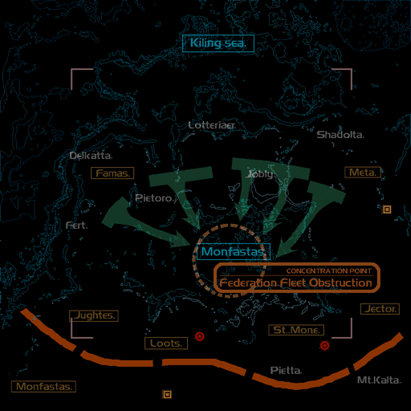
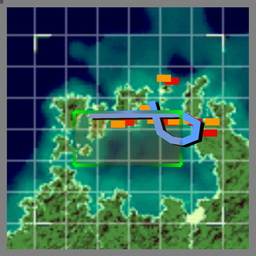

# Mission Data 

<table id="targetList" class="pageLinksTable">
  <tr>
    <td class ="tableImage" colspan="2"></td>
  </tr>
  <tr>
    <td>Location</td>
    <td>Despard Islands/Deceper Islands</td>
  </tr>
  <tr>
    <td>Objective</td>
    <td>Sink all destroyers and aircraft carriers</td>
  </tr>
  <tr>
    <td>Time Limit</td>
    <td>7 Minutes</td>
  </tr>
  <tr>
    <td>Time of Day</td>
    <td>Noon</td>
  </tr>
</table>

# Briefing

  

We have intelligence of an impending rendezvous in the Despard Islands area of major enemy battleships dispersed in different regions.
Its success means the mobilization of a powerful fleet.
Your mission is to strike the enemy battleships before the rendezvous.
The defensive capabilities of an individual battleship are limited, but once a fleet has been assembled, our hands will be tied.
Prevent this at all costs. 

# Mission Map

  

# Enemy List
|Name|Type|Quantity|Score|
|-|-|-|-|
|Destroyer|Target - Sea|3|12,000|
|Carrier|Target - Sea|3|22,000|
|Destroyer|Enemy - Sea|2|12,000|
|Gun Pod|Enemy - Sea|8|6,000|
|Missile Pod|Enemy - Sea|3|6,000|
|[F-14D Tomcat](/aircraft/17_f-14d)|Enemy - Air|2|46,000|
|[Rafale](/aircraft/23_rafale)|Enemy - Air|2|45,000|
|[Sea Harrier](/aircraft/07_sea-harrier)|Enemy - Air|1|36,000|
|[F/A-18C Hornet](/aircraft/13_fa-18c)|Enemy - Air|1|43,000|
|[Su-34 Platypus](/aircraft/24_su-34)|Enemy - Air|1|45,000|

# Unlock Reward
- [F-4E Phantom II](/aircraft/05_f-4e)
- [Mirage 2000](/aircraft/06_mirage-2000)

# Mission Guide
The first anti-ship mission in the game which also represents major difficulty spike as early as second mission. As if 7 minutes timer isn't restrictive enough, there are half dozens of fighters that can easily outturn and dogpile on player's six o' clock when left unchecked and on Hard difficulty, all of them except the Hornets and Harriers can tank up to three missiles before going down.

When coming unprepared for dogfight, one can easily ignore all enemy fighters and rush in towards the target ships with either newly unlocked aircraft from the previous mission (MiG-21 and Kfir) as their high speed proven advantageous at outrunning enemy jets here.

<b>IMPORTANT NOTE</b>: 
- While each individual ship turret can be destroyed for extra cash, it's not worth the effort and missile as they give minusicle reward and each takes at least two missile to destroy.