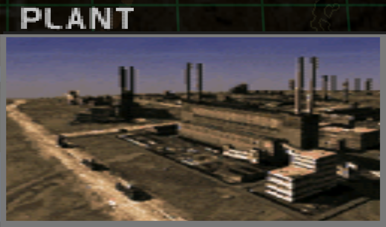
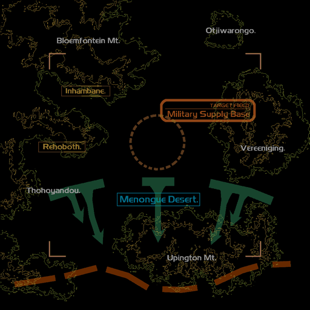
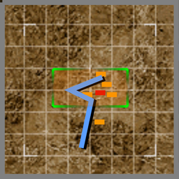

# Mission Data 

<table id="targetList" class="pageLinksTable">
  <tr>
    <td class ="tableImage" colspan="2"></td>
  </tr>
  <tr>
    <td>Location</td>
    <td>Military Supply Base/Laconia Weapons Plant</td>
  </tr>
  <tr>
    <td>Objective</td>
    <td>Destroy all ground facilities and tanker trucks</td>
  </tr>
  <tr>
    <td>Time Limit</td>
    <td>10 Minutes</td>
  </tr>
  <tr>
    <td>Time of Day</td>
    <td>Noon</td>
  </tr>
</table>

# Briefing

  

We have been tricked.
The enemy fleet was nothing more than a diversion while they made their move from another direction.
The enemy now has control of the largest of our military supply bases.
Your mission is to destroy the seized supply base and ensure that it is as useless to them as it is to us.
You have the command's go-ahead to decimate the facility. 

# Mission Map

  

# Enemy List
|Name|Type|Quantity|Score|
|-|-|-|-|
|Tank Truck|Target - Ground|15|2,000|
|Facility|Target - Ground|4|6,500|
|Tank|Enemy - Ground|5|5,000|
|[E.E. Lightning/F6](/aircraft/01_ee-lightning)|Enemy - Air|1|38,000|
|[F-4E Phantom II](/aircraft/05_f-4e)|Enemy|2|36,000|
|[F-5E Tiger II](/aircraft/02_f-5e)|Enemy|1|30,000|
|[MiG-21 Fishbed](/aircraft/03_mig-21)|Enemy|1|33,000|
|[Kfir C.7](/aircraft/04_kfir_c7)|Enemy|2|31,000|

# Unlock Reward

- [English Electric Lightning/F6](/aircraft/01_ee-lightning) (Requires Gun kill)
- [MiG-31 Foxhound](/aircraft/08_mig-31)
- [F-20 Tigershark](/aircraft/09_f-20)

# Mission Guide
A breather mission compared to the previous naval strike mission, for a ground strike mission there's no anti-aircraft to worry about and enemy fighters are placed relatively far between each other that they're much easier to pick one by one, not to mention they use more reasonably inferior aircraft compared to the last two missions. While tanks and tanker trucks can be destroyed normally using guns, target building only can be destroyed by missiles and each require two missiles to destroy.

To unlock the [English Electric Lightning/F6](/aircraft/01_ee-lightning) early (which also serves as the only way to unlock it on other difficulty level below hard), shoot down the enemy E.E. Lightning using guns. Note that the only required part for the gun kill is the finishing blow using gun, damaging it using missile beforehand is still allowed.

<b>IMPORTANT NOTE</b>

- Destroying the target building requires two missiles as they cannot be destroyed using guns. Prioritize striking them first before the tanker trucks to make sure mission progress doesn't get bricked when running out of missiles without realizing.

- Destroyed tanker truck will cause chain reaction that destroys the other two adjacent trucks, so technically only one missile is required to destroy a whole tanker convoy.