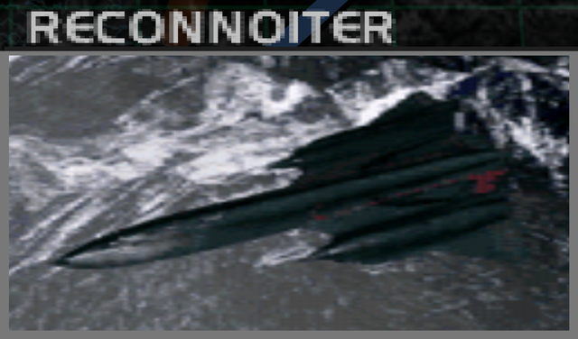
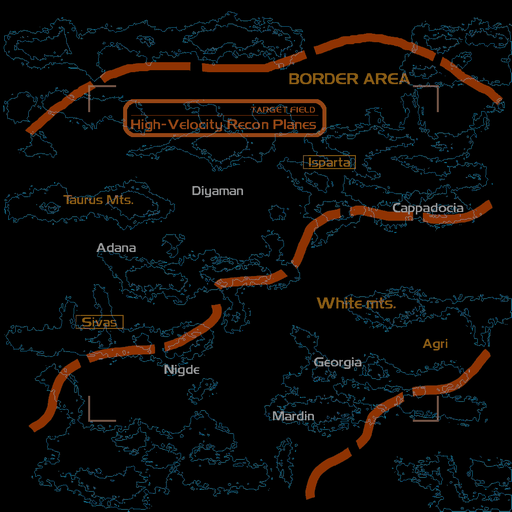
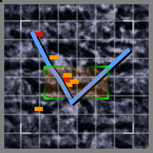

# Mission Data 

<table id="targetList" class="pageLinksTable">
  <tr>
    <td class ="tableImage" colspan="2"></td>
  </tr>
  <tr>
    <td>Location</td>
    <td>Border Region</td>
  </tr>
  <tr>
    <td>Objective</td>
    <td>Shoot down all SR-71 Blackbirds</td>
  </tr>
  <tr>
    <td>Time Limit</td>
    <td>10 Minutes</td>
  </tr>
  <tr>
    <td>Time of Day</td>
    <td>Noon</td>
  </tr>
</table>

# Briefing

  

Our ground forces have almost completed their removal of landed enemy troops.
We have plans to attempt landing of our own in hostile territory, but it is highly probable that the enemy's high-velocity reconnaissance planes will give them the means to detect our landing site.
Your mission is to neutralize these high-velocity reconnaissance planes.
Because their speed gives them a high degree of invulnerability during flight, you will make your attack during the recon planes' aerial rendezvous with the fueling jet.
Do not miss this assault window. 

# Mission Map

  

# Enemy List
|Name|Type|Quantity|Score|
|-|-|-|-|
|SR-71 Blackbird|Target - Air|2|75,000|
|KC-135R|Enemy - Air|2|40,000|
|[EF2000 Typhoon](/aircraft/25_ef2000)|Enemy - Air|2|46,000|
|[F-16 Fighting Falcon](/aircraft/12_f-16)|Enemy - Air|2|39,000|
|[MiG-31 Foxhound](/aircraft/08_mig-31)|Enemy - Air|2|40,000|

# Unlock Reward
- [MiG-29 Fulcrum](/aircraft/11_mig-29)
- [F-16 Fighting Falcon](/aircraft/12_f-16)

# Mission Guide
As if completing the mission name and <a href="m3-military-supply-base.md">previous mission</a> reward unlocks the MiG-31 not enough to tell the nature of this mission, a fast aircraft is required to catch up with the SR-71. Despite the generous time limit, the mission will end in a failure if any of the SR-71 leaves the combat area.

Enemy fighters mostly serve as nothing but distraction but it's still technically doable to shoot them all down before any of the Blackbird finishes their refueling. When approaching them fast enough, it's even possible to shoot them down before they can react.

<b>IMPORTANT NOTE</b>
- The Blackbird only slows down when they're refueling. Shooting down the tanker they're connected with will immediately make them resume their high speed flight route towards the map boundary.