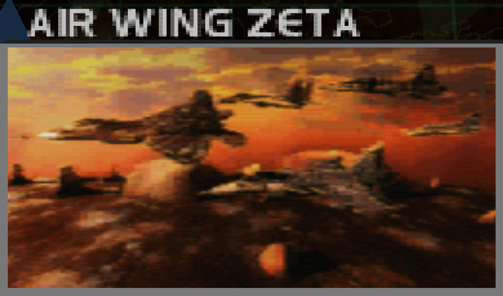
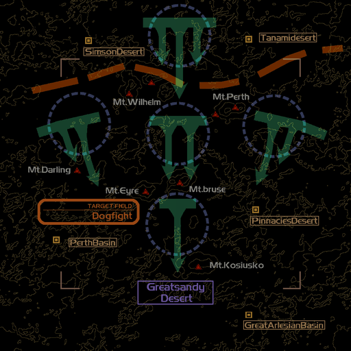
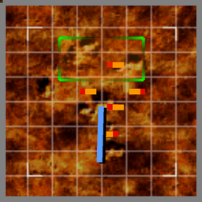

# Mission Data 

<table id="targetList" class="pageLinksTable">
  <tr>
    <td class ="tableImage" colspan="2"></td>
  </tr>
  <tr>
    <td>Location</td>
    <td>Zeta Base</td>
  </tr>
  <tr>
    <td>Objective</td>
    <td>Shoot down all targets</td>
  </tr>
  <tr>
    <td>Time Limit</td>
    <td>10 Minutes</td>
  </tr>
  <tr>
    <td>Time of Day</td>
    <td>Dawn</td>
  </tr>
</table>

# Briefing

  

You are ordered by Air Command to strike PFAF's aerial force at Zeta Base.
This is essential in procuring air control for our ground troops once they have successfully landed.
Your mission is to inflict maximum damage on the enemy air squadron.
Also, there are unconfirmed sightings of our former comrades at the Zeta Base.
Keep in mind that the top squadron of our - former - Dzavailar Foreign Air Corps was stationed at that base.
No possibility can be discounted; watch your back. 

# Mission Map

  

# Enemy List
|Name|Type|Quantity|Score|
|-|-|-|-|
|[F-22 Raptor](/aircraft/29_f-22)|Target - Air|1|85,500|
|[MiG-21 Fishbed](/aircraft/03_mig-21)|Target - Air|1|49,500|
|[JAS39 Gripen](/aircraft/22_jas39)|Target - Air|1|64,500|
|[MiG-29 Fulcrum](/aircraft/11_mig-29)|Target - Air|1|72,000|
|[F-20 Tigershark](/aircraft/09_f-20)|Target - Air|1|58,500|
|[F-4E Phantom II](/aircraft/05_f-4e)|Enemy - Air|5|36,000|
|[F-16 Fighting Falcon](/aircraft/12_f-16)|Enemy|1|39,000|
|[F-15E Strike Eagle](/aircraft/18_f-15e)|Enemy|1|50,000|

# Unlock Reward
- [F/A-18E Super Hornet](/aircraft/14_fa-18e)

# Mission Guide
An one versus many furball mission. Despite the mission seem daunting at first, enemies aren't as aggressive and their placement isn't tight enough to quickly surround the player. Target enemies have better skill than normally, but the Phantoms usually flies passively and don't engage the player frequently so they can be safely ignored.