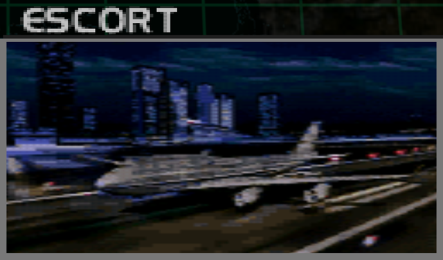
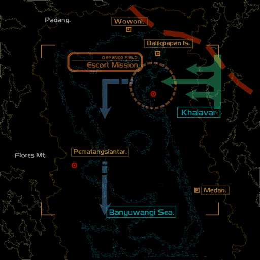
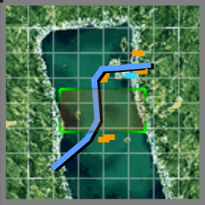

# Mission Data 

<table id="targetList" class="pageLinksTable">
  <tr>
    <td class ="tableImage" colspan="2"></td>
  </tr>
  <tr>
    <td>Location</td>
    <td>Khalavar City</td>
  </tr>
  <tr>
    <td>Objective</td>
    <td>Escort the Civilian aircraft to safely</td>
  </tr>
  <tr>
    <td>Time Limit</td>
    <td>10 Minutes</td>
  </tr>
  <tr>
    <td>Time of Day</td>
    <td>Midnight</td>
  </tr>
</table>

# Briefing

  

We have a request from the government.
A group of freed Laconian prisoners in Khalavar, one of the Federation's provincial capitals, is being transported by a civilian aircraft and needs an escort.
Your mission is to accompany and guard the plane from the time of its takeoff from the airport.
These are civilians who were detained when the war broke out.
Bring them home safely.
The plane is scheduled for departure at 00:00.
Also, enemy ground forces appear to be gearing up to recapture Khalavar.
They are armed with anti-aircraft guns; destroy these and secure the plane from attack. 

# Mission Map

  

# Enemy List
|Name|Type|Quantity|Score|
|-|-|-|-|
|Airliner|Friendly - Air|1|-|
|[MiG-21 Fishbed](/aircraft/03_mig-21)|Enemy - Air|2|33,000|
|[Kfir C.7](/aircraft/04_kfir_c7)|Enemy - Air|2|31,000|
|[F-14D Tomcat](/aircraft/17_f-14d)|Enemy - Air|2|46,000|
|[F-20 Tigershark](/aircraft/09_f-20)|Enemy - Air|2|39,000|
|Destroyer|Enemy - Sea|4|22,000|
|Carrier|Enemy - Sea|2|12,000|
|Gun Pod|Enemy - Sea|6|6,000|
|Missile Pod|Enemy - Sea|2|6,000|
|Gun Pod|Enemy - Ground|3|4,500|
|Missile Pod|Enemy - Ground|3|4,500|
|Tank|Enemy - Ground|2|4,500|

# Unlock Reward
- [Tornado F3](/aircraft/15_tornado_f3)

# Mission Guide
The player has 2 minutes time window before escort target takes off. Tanks and ground based SAMs will target the airliner while enemy aircraft won't target it until it gets airborne so prioritize shooting down all fighters before the airliner takes off. Once the airliner takes off, a wave of enemy fighters containing of two F-20 and two F-14D will rush towards the airliner. These enemies have their AI set to prioritize targeting it no matter how much you aggro them, letting all of them get into firing range of the airliner would let them shoot down the airliner in mere seconds. 

There are some warships near the vicinity of the airliner's flight path but the airliner doesn't get into the ships' missile range, so they can be safely ignored.

<b>IMPORTANT NOTE</b>

- Enemy F-20s and F-14Ds do not attempt to evade when the player attacks them which should give the player enough time window to shoot them down before they can destroy the airliner.