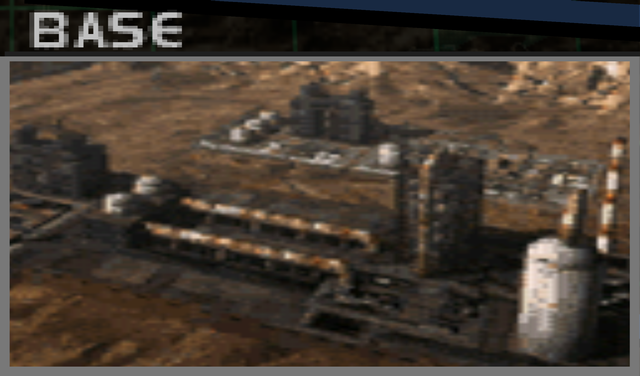
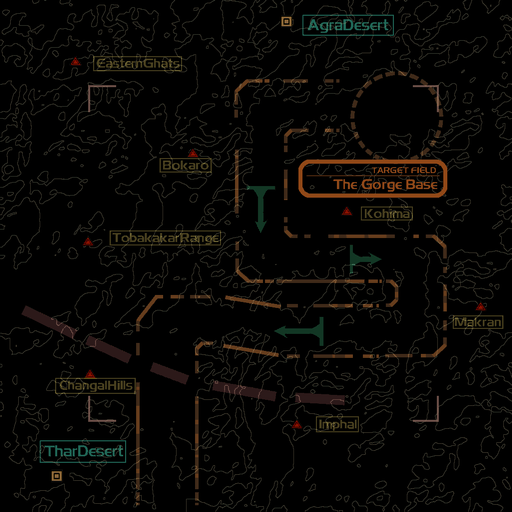

# Mission Data 

<table id="targetList" class="pageLinksTable">
  <tr>
    <td class ="tableImage" colspan="2"></td>
  </tr>
  <tr>
    <td>Location</td>
    <td>Mt. Alathia</td>
  </tr>
  <tr>
    <td>Objective</td>
    <td>Destroy all ground facilities</td>
  </tr>
  <tr>
    <td>Time Limit</td>
    <td>10 Minutes</td>
  </tr>
  <tr>
    <td>Time of Day</td>
    <td>Noon</td>
  </tr>
</table>

# Briefing

  

An attack is being mounted on an enemy supply base in the Algoss province in order to assist our ground forces to penetrate into the interior regions.
Your mission is to confirm the presence of and eradicate the enemy supply base hidden in the mountains.
The site is a natural fortress, impregnable to land assault.
In addition, the air space above the gorges is saturated with their aerial defense network.
We recommend that you fly within the gorge, and be on guard against making contact with the rock face. 

# Mission Map

  

# Enemy List
|Name|Type|Quantity|Score|
|-|-|-|-|
|Base|Target - Ground|7|6,500|
|Gun Pod|Enemy - Ground|10|4,500|
|AH-64 Apache|Enemy - Air|3|30,000|
|Mi-24 Hind|Enemy - Air|3|30,000|

# Unlock Reward
- [A-10 Thunderbolt II](/aircraft/16_a-10)

# Mission Guide
Yet another genre signature mission in form of altitude restricted ravine flight level. The primary threat while navigating through the ravine is the Apache and Hind gunships as they're very relentless at throwing missiles whenever the player gets in their range, and surprisingly durable especially on Hard. All the primary targets lies at the end of the ravine, in which each of them requires two missiles to destroy.