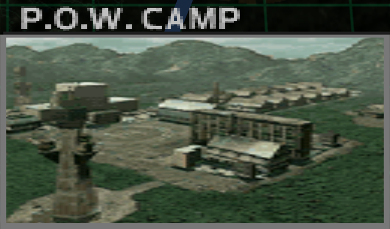
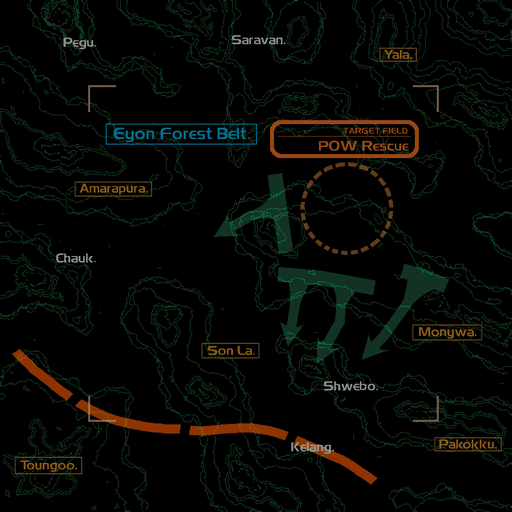
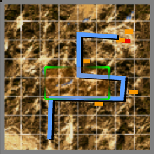

# Mission Data 

<table id="targetList" class="pageLinksTable">
  <tr>
    <td class ="tableImage" colspan="2"></td>
  </tr>
  <tr>
    <td>Location</td>
    <td>Eyon Forest Belt</td>
  </tr>
  <tr>
    <td>Objective</td>
    <td>Destroy all targets</td>
  </tr>
  <tr>
    <td>Time Limit</td>
    <td>10 Minutes</td>
  </tr>
  <tr>
    <td>Time of Day</td>
    <td>Noon</td>
  </tr>
</table>

# Briefing

  

Our intel department has discovered the whereabouts of a POW Camp.
The Army Special Forces rescue team is on its way as we speak.
Your mission is to secure the air space above the camp perimeter.
The rescue team is being extracted by a chopper.
This calls for neutralization of enemy air facilities as well.
Ensure the rescue mission's success at any cost. 

# Mission Map

  

# Enemy List
|Name|Type|Quantity|Score|
|-|-|-|-|
|UH-60|Friendly - Air|1|-|
|POW Camp|Target - Ground|3|6,000|
|Gun Pod|Target - Ground|8|4,500|
|[MiG-21 Fishbed](/aircraft/03_mig-21)|Target - Air|1|49,500|
|[F-4E Phantom II](/aircraft/05_f-4e)|Enemy - Air|4|36,000|
|Mi-24 Hind|Enemy - Air|2|30,000|
|B-2A|Enemy - Air|2|45,000|
|Gun Pod|Enemy - Ground|2|4,500|
|Gun Pod|Enemy - Ground|10|6,000|

# Unlock Reward
- [F-14D Tomcat](/aircraft/17_f-14d)

# Mission Guide
A straightforward air-to-ground mission disguised as escort mission, since all enemies never target the allied helicopter player is escorting. Aside of helicopter gunships and F-4E, only the gun towers pose actual threat to the player since they can whittle down player's health very quickly. Lastly, the MiG-21 Ace from <a href="../missions/m05-dogfight">Dogfight Mission</a> makes its reappearance as primary target.

There's a known bug in the US version where the UH-60 already spawns above the POW camp instead of near player starting point but it doesn't really alter the fundamentals of the mission since enemy AI in this mission still don't attempt to engage it.