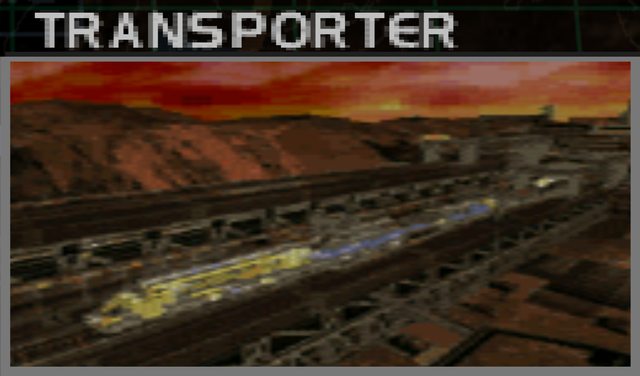
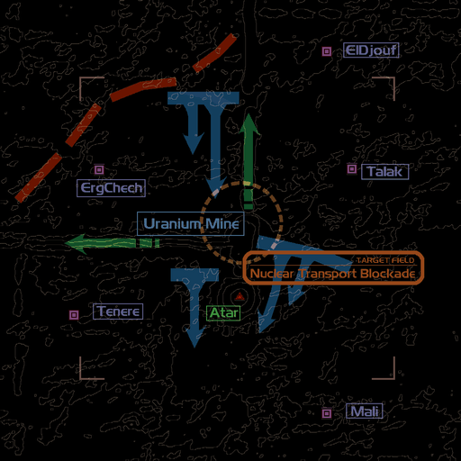
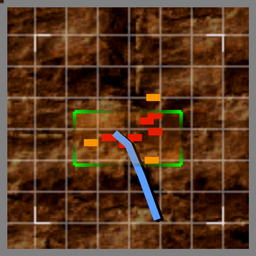

# Mission Data 

<table id="targetList" class="pageLinksTable">
  <tr>
    <td class ="tableImage" colspan="2"></td>
  </tr>
  <tr>
    <td>Location</td>
    <td>Uranium Mine</td>
  </tr>
  <tr>
    <td>Objective</td>
    <td>Destroy all targets before they escape from the battle zone</td>
  </tr>
  <tr>
    <td>Time Limit</td>
    <td>10 Minutes</td>
  </tr>
  <tr>
    <td>Time of Day</td>
    <td>Dusk</td>
  </tr>
</table>

# Briefing

  

We have information from one of the freed prisoners that the People's Federation is exchanging uranium for advanced weaponry with industrialized nations.
Taking out the uranium mine will ensure a drop in the enemy's war capability.
Your mission is to destroy the uranium mine as well as the transport rail line to the north of Khalavar.
Fierce resistance from the enemy is guaranteed, given the strategic importance of these sites.
. 

# Mission Map

  

# Enemy List
|Name|Type|Quantity|Score|
|-|-|-|-|
|Train|Target - Ground|4|10,000|
|DORA|Target - Ground|2|10,000|
|[A-10 Thunderbolt II](/aircraft/16_a-10)|Enemy - Air|2|32,000|
|[Mirage-2000](/aircraft/06_mirage-2000)|Enemy - Air|2|34,000|
|[MiG-29 Fulcrum](/aircraft/11_mig-29)|Enemy|2|48,000|
|Armed Traincar|Enemy - Ground|4|12,000|
|Cargo|Enemy - Ground|12|5,000|
|Gun Pod|Enemy - Ground|12|6,000|
|Missile Pod|Enemy - Ground|2|6,000|

# Unlock Reward
- [F-117A Nighthawk](/aircraft/19_f-117a)
- [F-15S/MT Active](/aircraft/21_f-15sactive)

# Mission Guide
This mission has much stricter time limit than the displayed time limit suggests, as each train except the first one (which is already on the move as soon as the mission begins) will depart after certain time has passed, and any of them leaving the battle zone will result in mission failure. The first two trains will depart to the west, while the other two will depart to the north.
Both routes travel accross a long tunnel each, which makes intercepting the trains difficult once they enter the tunnel, as such it's recommended to destroy the train before the train enters the tunnel. Unlike ships, destroying the train engine does not result in chain reaction that destroys the rest of its component.

<b>IMPORTANT NOTE</b>
- Unlike the transport trains, the DORA railway artilleries do not attempt to leave the map. Which allows the player to save them for the last when attempting to clear the map of all enemies.