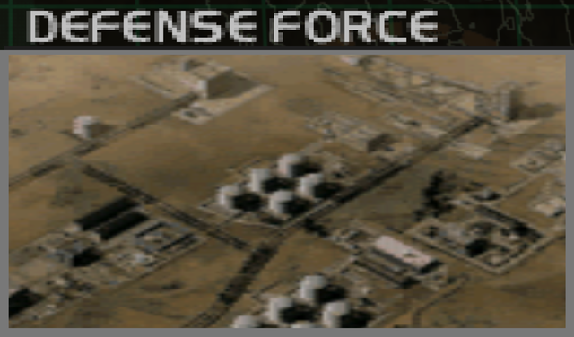
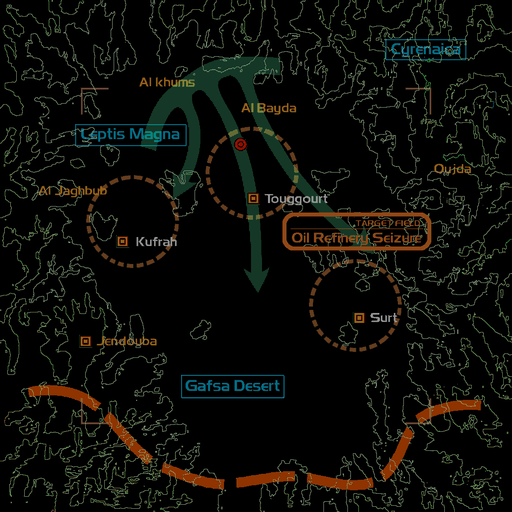
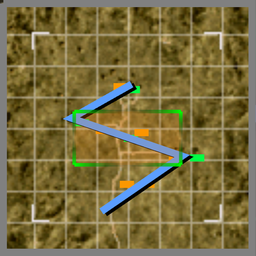

# Mission Data 

<table id="targetList" class="pageLinksTable">
  <tr>
    <td class ="tableImage" colspan="2"></td>
  </tr>
  <tr>
    <td>Location</td>
    <td>Oil Refinery</td>
  </tr>
  <tr>
    <td>Objective</td>
    <td>Destroy all targets</td>
  </tr>
  <tr>
    <td>Time Limit</td>
    <td>10 Minutes</td>
  </tr>
  <tr>
    <td>Time of Day</td>
    <td>Noon</td>
  </tr>
</table>

# Briefing

  

Our Military Command has decided to make the severing of the enemy supply route and annihilation of their war reserve our top priority.
Striking key production and supply points constitute an indirect assault against the enemy's war resources.
Your mission is to secure the oil refinery to the south of Gholanda.
The petroleum facility should prove an advantage to our invading forces, and you are ordered not to fire upon any of the related facilities.
In addition, we have reports of enemy air squads approaching in anticipation of our attack.
Secure the facility before their defenses are complete. 

# Mission Map

  

# Enemy List
|Name|Type|Quantity|Score|
|-|-|-|-|
|Oil Tank|Neutral - Ground|35|-5,000|
|Missile Pod|Target - Ground|3|6,000|
|Tank|Target - Ground|2|4,500|
|Paratank|Target - Ground|10|5,000|
|Gun Pod|Enemy - Ground|2|4,500|
|C-5B|Enemy - Air|2|40,000|
|[F-5E Tiger II](/aircraft/02_f-5e)|Enemy - Air|2|30,000|
|[F-16 Fighting Falcon](/aircraft/12_f-16)|Enemy|2|39,000|
|[Tornado F3](/aircraft/15_tornado_f3)|Enemy|2|36,000|
|[A-10 Thunderbolt II](/aircraft/16_a-10)|Enemy|2|32,000|

# Unlock Reward
- [JAS39 Gripen](/aircraft/22_jas39)

# Mission Guide
The only mission in the game where neutral targets are present, in which each destroyed neutral target will deduct player's credits. Thankfully all ground targets aren't so tightly bunched near the oil tanks so it's near impossible to destroy the oil tanks by accident unless if the player is very reckless at switching targets and shooting missiles.

The C-5s near the starting point drops few airborne tanks designated as primary targets.

<b>IMPORTANT NOTE</b>

- The C-5s themselves are armed with rear fire missile for some reason and will shoot back if the player lingers around on their six o' clock.