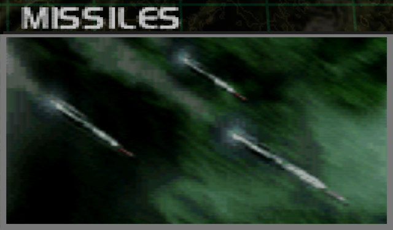
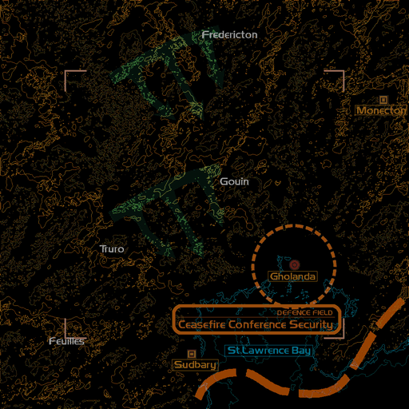
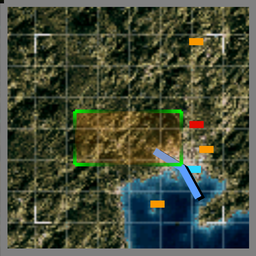

# Mission Data 

<table id="targetList" class="pageLinksTable">
  <tr>
    <td class ="tableImage" colspan="2"></td>
  </tr>
  <tr>
    <td>Location</td>
    <td>Golanda City</td>
  </tr>
  <tr>
    <td>Objective</td>
    <td>Defend the Conference Center</td>
  </tr>
  <tr>
    <td>Time Limit</td>
    <td>10 Minutes</td>
  </tr>
  <tr>
    <td>Time of Day</td>
    <td>Noon</td>
  </tr>
</table>

# Briefing

  

Our government and the People's Federation government have accepted the U.N.'s offer to arbitrate.
The negotiations are to be held in coastal city of Golanda, adjoining the zone under our military control, but according to intelligence reports, the Federation government plans to attack the conference hall using men disguised as members of our forces.
Your mission is to defend the high-rise housing the conference hall.
The success of their plot could mean the ranging of the international community against us.
We cannot simply concede defeat; their plan must be stopped. 

# Mission Map

  

# Enemy List
|Name|Type|Quantity|Score|
|-|-|-|-|
|Conference Center|Friendly - Ground|1|-|
|M.R.M.T|Target - Air|10|8,000|
|[F-20 Tigershark](/aircraft/09_f-20)|Target - Air|1|58,500|
|B-2A|Enemy - Air|1|45,000|
|[EF2000 Typhoon](/aircraft/25_ef2000)|Enemy - Air|2|46,000|
|[Su-27B Flanker](/aircraft/20_su-27b)|Enemy - Air|2|44,000|

# Unlock Reward
- [Rafale](/aircraft/23_rafale)

# Mission Guide
Defend the Conference Center against wave of missiles. There are 10 missiles in total and each appear in sequence from the north and west, flying slowly towards the Conference Center. There's also a lone B-2A flying from the north that somehow attempts to perform kamikaze run on the Conference Center, but it doesn't seem to do any harm to the building should it managed to crash into it.

Once all missiles have been taken care of, all that's left is disposing the F-20 Ace previously encountered in <a href="../missions/m05-dogfight">Dogfight Mission</a> to accomplish this mission.