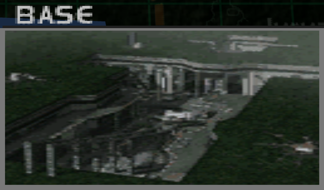
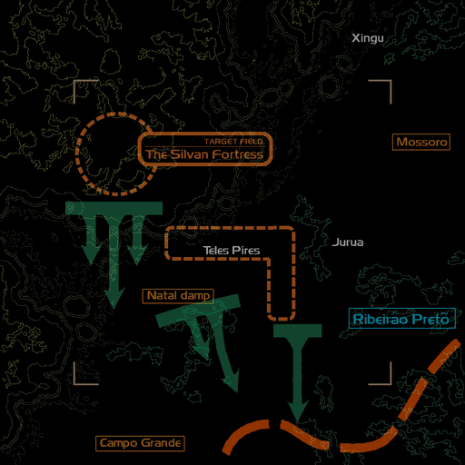
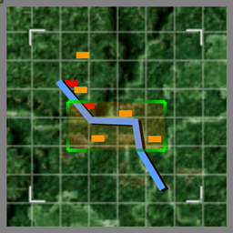

# Mission Data 

<table id="targetList" class="pageLinksTable">
  <tr>
    <td class ="tableImage" colspan="2"></td>
  </tr>
  <tr>
    <td>Location</td>
    <td>Beta Base</td>
  </tr>
  <tr>
    <td>Objective</td>
    <td>Destroy all Targets</td>
  </tr>
  <tr>
    <td>Time Limit</td>
    <td>10 Minutes</td>
  </tr>
  <tr>
    <td>Time of Day</td>
    <td>Night</td>
  </tr>
</table>

# Briefing

  

The Federation's conspiracy has been exposed to the world.
The international community is beginning to back our side.
The Military Command has decided to take this opportunity to mount an attack on all fronts.
Our corps will be mounting an offensive against an enemy fortress apprehended by a military satellite.
Your mission is to neutralize an enemy fortress hidden in the forest.
We also have reports that this fortress houses a giant-class bomber plane carrying nuclear payload.
Fly in towards the point of two rivers' convergence. 

# Mission Map

  

# Enemy List
|Name|Type|Quantity|Score|
|-|-|-|-|
|XBC-97|Target- Air|1|60,000|
|XBC-97|Target- Ground|1|60,000|
|Tank|Target- Ground|1|5,000|
|Missile Pod|Target- Ground|2|6,000|
|Gun Pod|Target- Ground|10|4,500|
|Gun Pod|Target- Ground|10|4,500|
|Gun Pod|Enemy- Ground|1|4,500|
|Gun Pod|Enemy- Ground|6|6,000|
|Attack Ship|Enemy- Sea|3|5,000|
|[AV-8B Harrier II](/aircraft/10_av-8b)|Enemy - Air|1|30,000|
|[Rafale](/aircraft/23_rafale)|Enemy|4|45,000|
|[YF-23 Blackwidow](/aircraft/27_yf-23)|Enemy|4|56,000|

# Unlock Reward
- [EF2000 Typhoon](/aircraft/25_ef2000)

# Mission Guide
The primary target in this mission are two fictional, gigantic bombers and the defenses around the fortress itself. One of the bomber is already airborne and will circle around the fortress area, while the second bomber is parked inside the fortress. There are various enemies around the river on the way to the fortress as well.

The bomber themselves pose no significant threat as they're only armed with machine gun turrets, and the parked one doesn't fire at the player. The real threat in this mission however, is the four YF-23s guarding the fortress which can easily overwhelm the player.