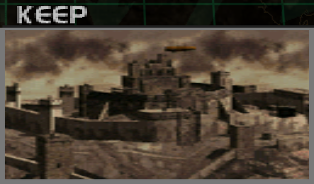
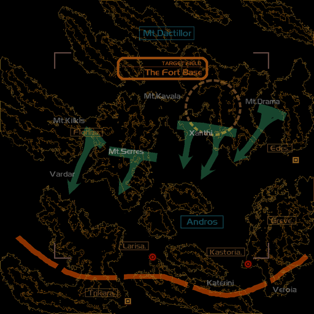
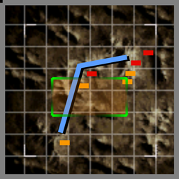

# Mission Data 

<table id="targetList" class="pageLinksTable">
  <tr>
    <td class ="tableImage" colspan="2"></td>
  </tr>
  <tr>
    <td>Location</td>
    <td>Mt. Coridalos</td>
  </tr>
  <tr>
    <td>Objective</td>
    <td>Destroy all Targets</td>
  </tr>
  <tr>
    <td>Time Limit</td>
    <td>10 Minutes</td>
  </tr>
  <tr>
    <td>Time of Day</td>
    <td>Dawn</td>
  </tr>
</table>

# Briefing

  

We have a request for assistance from the army.
A medieval castle in the mountain regions has been fortified into a virtually impregnable base, and they can't even get near it.
Your mission is to infiltrate the castle fortress.
This would normally fall under the Army's jurisdiction, but the site must have significant ground defenses for them to come crawling to us.
A thorough ground defense means a high level of air defenses.
The Army will owe us one if we pull this off.
Let's retire the castle ourselves. 

# Mission Map

  

# Enemy List
|Name|Type|Quantity|Score|
|-|-|-|-|
|Air Ship AA|Target - Air|1|12,000|
|Air Ship AG|Target - Air|1|12,000|
|Gun Pod|Target - Ground|5|4,500|
|[MiG-29 Fulcrum](/aircraft/11_mig-29)|Target - Air|1|72,000|
|Gun Pod|Enemy - Ground|14|4,500|
|[Tornado F3](/aircraft/15_tornado_f3)|Enemy - Air|2|36,000|
|[Su-27B Flanker](/aircraft/20_su-27)|Enemy|2|44,000|
|[JSF X-32](/aircraft/30_x-32)|Enemy|2|55,000|
|[F-22 Raptor](/aircraft/29_f-22)|Enemy|2|57,000|

# Unlock Reward
- [Su-37 Flanker](/aircraft/26_su-37)

# Mission Guide
Another simple air-to-ground sortie. The ground targets are mostly located at the other end of the map relative to starting point, with some AA guns and tough fighters scattered along the way .

Enemy fighters start to appear with higher end jets aand their AI are becoming more aggressive from this point onward, which the player should take caution when attempting to shoot down all non-essential targets. 