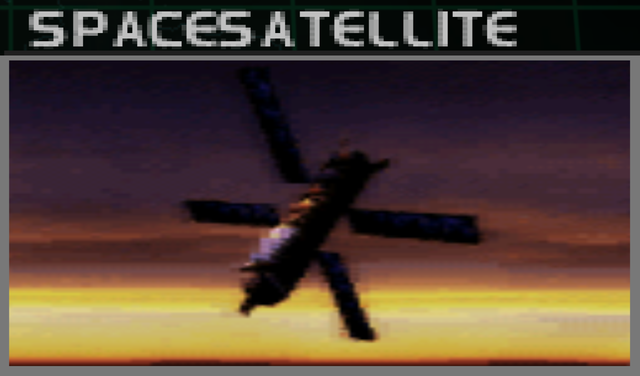
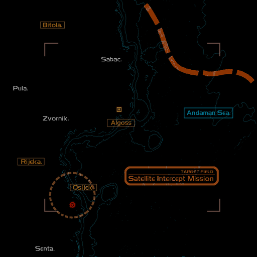
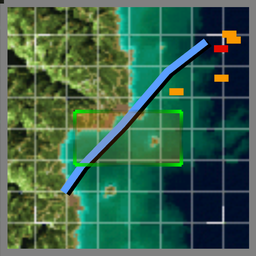

# Mission Data 

<table id="targetList" class="pageLinksTable">
  <tr>
    <td class ="tableImage" colspan="2"></td>
  </tr>
  <tr>
    <td>Location</td>
    <td>Algoss City</td>
  </tr>
  <tr>
    <td>Objective</td>
    <td>Destroy all Targets</td>
  </tr>
  <tr>
    <td>Time Limit</td>
    <td>1 Minute 45 Seconds</td>
  </tr>
  <tr>
    <td>Time of Day</td>
    <td>Evening</td>
  </tr>
</table>

# Briefing

  

An emergency communication just came in from the Command.
The orbit of a large Federation military satellite is degrading, and the satellite has already begun its descent to the ground.
The estimated site of impact is judged to be in the vicinity of the former Federation capital that was liberated by our forces.
Your mission is to intercept the falling satellite.
Target the satellite's wing area and change the trajectory of its descent.
There's very little time - get to it! 

# Mission Map

  

# Enemy List
|Name|Type|Quantity|Score|
|-|-|-|-|
|Satellite|Target - Air|1 (4 components)|200,000|
|[F-15S/MT Active](/aircraft/21_f-15sactive)|Enemy - Air|2|54,000|
|X-36|Enemy - Air|2|30,000|
|m944|Enemy - Air|1|30,000|
|m367|Enemy - Air|1|30,000|

# Unlock Reward
- [YF-23 Blackwidow](/aircraft/27_yf-23)

# Mission Guide
A retroactively familiar satellite intercept mission, as well as one of the most difficult mission in the game due to extremely limited time limit combined with relentless pursuit from the two F-15S/MT Active. The satellite consists of four solar panel components, each requires at least eight missiles to destroy. Use the missile reload exploit  to quickly destroy each panel, and don't be afraid to jink or hard turn whenever the F-15S/MT starts firing missiles at the player.

The X-36 and other two air units (Drones) don't shoot back nor doing anything than following their flight pattern, but considering the urgency of this mission it's best to ignore them.