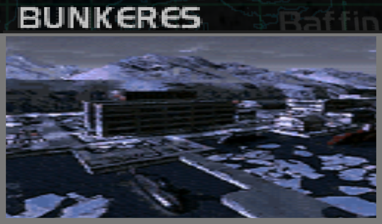
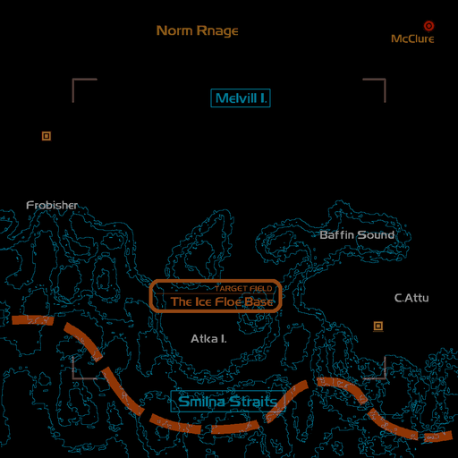
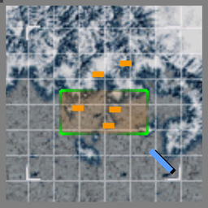

# Mission Data 

<table id="targetList" class="pageLinksTable">
  <tr>
    <td class ="tableImage" colspan="2"></td>
  </tr>
  <tr>
    <td>Location</td>
    <td>Smyrna Straits</td>
  </tr>
  <tr>
    <td>Objective</td>
    <td>Destroy all Targets</td>
  </tr>
  <tr>
    <td>Time Limit</td>
    <td>10 Minutes</td>
  </tr>
  <tr>
    <td>Time of Day</td>
    <td>Noon</td>
  </tr>
</table>

# Briefing

  

We have a Navy communication requesting assistance.
The Federation Navy has been active in their use of submarines to attack transport ships.
Your mission is to search out and destroy the submarines' base of operation.
Unfortunately, the location of the enemy base is unclear.
The area is heavily snowbound, rendering radar sweeps ineffectual.
Track the course of the icebreakers heading for the base. 

# Mission Map

  

# Enemy List
|Name|Type|Quantity|Score|
|-|-|-|-|
|Submarine|Target- Sea|4|10,000|
|Nuclear Submarine|Target- Sea|1|12,000|
|Icebreaker|Enemy - Sea|3|4,500|
|Gun Pod|Enemy - Ground|3|4,500|
|Missile Pod|Enemy - Ground|3|4,500|
|[F/A-18C Hornet](/aircraft/13_fa-18c)|Enemy - Air|2|42,000|
|[MiG-31 Foxhound](/aircraft/08_mig-31)|Enemy - Air|2|40,000|
|[Su-37 Flanker](/aircraft/26_su-37)|Enemy - Air|2|52,000|
|[JAS39 Gripen](/aircraft/22_jas39)|Enemy - Air|2|43,000|
|[EF2000 Typhoon](/aircraft/25_ef2000)|Enemy - Air|2|46,000|

# Unlock Reward
- [F-22 Raptor](/aircraft/29_f-22)

# Mission Guide
Player have limited radar visibility for this mission as stated on the briefing. The target submarines are located in a submarine base to the north east side of the map relative to starting player heading. The submarine base has few defenses, but the submarine themselves only have a SAM to defend itself.

While finding the submarine base, try to evade or outrun enemy fighters as it's very easy to get overwhelmed by their numbers. The four submarines are inside submarine pen each, while the distinctive looking nuclear submarine is in the open water near the base.