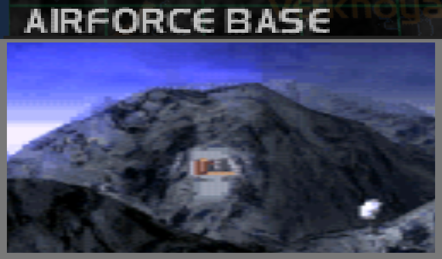
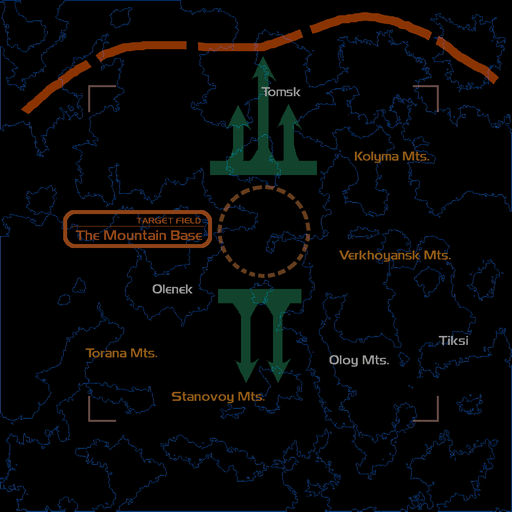
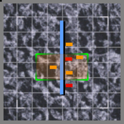

# Mission Data 

<table id="targetList" class="pageLinksTable">
  <tr>
    <td class ="tableImage" colspan="2"></td>
  </tr>
  <tr>
    <td>Location</td>
    <td>Alpha Base</td>
  </tr>
  <tr>
    <td>Objective</td>
    <td>Destroy all Targets</td>
  </tr>
  <tr>
    <td>Time Limit</td>
    <td>10 Minutes</td>
  </tr>
  <tr>
    <td>Time of Day</td>
    <td>Noon</td>
  </tr>
</table>

# Briefing

  

We are commencing an attack on our former Federation of Dzavailar AFB, the Alpha Base.
Just as in Zeta Base, the resistance we will be encountering will be offered by our former comrades.
They are now the enemy, and nothing more.
You would be too new at the Corps to know, but the Alpha Base is built using natural caverns in the rock terrain.
Use caution. 

# Mission Map

  

# Enemy List
|Name|Type|Quantity|Score|
|-|-|-|-|
|AA Radar|Target - Ground|3|6,600|
|AE Seeker|Target - Ground|1|6,600|
|Gun Pod|Target - Ground|4|4,500|
|Ceil Gun|Target - Ground|1|6,000|
|B-1B (Parked)|Target - Ground|1|45,000|
|B-2A (Parked)|Target - Ground|1|45,000|
|[YF-23 Blackwidow](/aircraft/27_yf-23) (Parked)|Target - Ground|1|56,000|
|[JAS39 Gripen](/aircraft/22_jas39)|Target - Air|1|64,500|
|[F-117A Nighthawk](/aircraft/19_f-117a)|Enemy - Air|2|32,000|
|[F-20 Tigershark](/aircraft/09_f-20)|Enemy - Air|2|39,000|
|[YF-23 Blackwidow](/aircraft/27_yf-23)|Enemy - Air|2|56,000|
|[F-22 Raptor](/aircraft/29_f-22)|Enemy - Air|2|57,000|

# Unlock Reward
- [X-32 JSF](/aircraft/30_x-32)

# Mission Guide
A tunnel flight mission where almost all targets, save for the enemy Ace in Gripen are lined up inside an underground airbase. Since all targets inside the tunnel requires at least two missiles each to destroy, it's best not to fly too fast nor too slow when flying inside the tunnel.

Should the player unable to destroy all targets in one run, consider continue flying out of the tunnel and do another run instead of turning around inside the tunnel as the tunnel isn't spacious enough to do an U-turn inside unless when using VTOL fighters unlocked on New Game+.