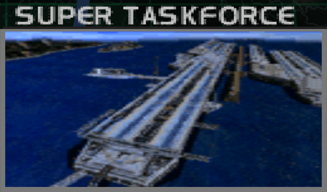
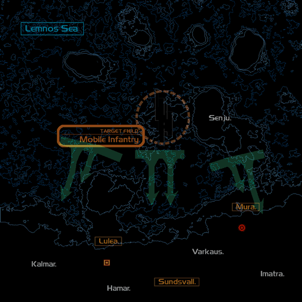
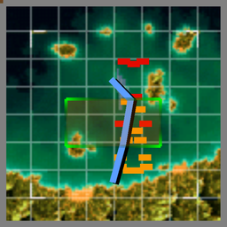

# Mission Data 

<table id="targetList" class="pageLinksTable">
  <tr>
    <td class ="tableImage" colspan="2"></td>
  </tr>
  <tr>
    <td>Location</td>
    <td>Sea of Limnoss</td>
  </tr>
  <tr>
    <td>Objective</td>
    <td>Destroy all Targets</td>
  </tr>
  <tr>
    <td>Time Limit</td>
    <td>10 Minutes</td>
  </tr>
  <tr>
    <td>Time of Day</td>
    <td>Noon</td>
  </tr>
</table>

# Briefing

  

Our forces are planning a landing on the Klonne Island, the stronghold of the People's Federation Government.
Our mission will be to precede the landing with an eradication of the remaining enemy fleet.
There are unconfirmed reports of large vessels left in the fleet.
There are also indications that the survivors of the old Air Force will be joining the fray en masse.
This will not be an easy fight.

# Mission Map

  

# Enemy List
|Name|Type|Quantity|Score|
|-|-|-|-|
|CV-X|Target - Sea|4|22,000|
|Facility|Target - Ground|2|6,500|
|AA Radar|Target - Ground|1|5,500|
|Control Tower|Target - Ground|2|7,000|
|Laboratory|Target - Ground|1|6,500|
|[S-37 Berkut](/aircraft/28_s-37)|Target - Air|1|73,500|
|Hangar|Enemy - Ground|13|7,000|
|Facility|Enemy - Ground|2|6,500|
|Gun Pod|Enemy - Ground|5|4,500|
|Missile Pod|Enemy - Ground|10|6,000|
|Missile Pod|Enemy - Sea|10|6,000|
|Stealth Ship|Enemy - Sea|6|12,800|
|[F-117A Nighthawk](/aircraft/19_f-117a)|Enemy - Air|2|32,000|
|[F/A-18C Hornet](/aircraft/13_fa-18c)|Enemy - Air|2|42,000|
|[Su-34 Platypus](/aircraft/24_su-34)|Enemy - Air|1|45,000|
|X-36|Enemy - Air|1|50,000|

# Unlock Reward
- [S-37 Berkut](/aircraft/28_s-37) (Requires Gun kill)

# Mission Guide
Massive mission with many ground and naval targets that require at least 2 missiles to kill, which makes ammo conservation more important than ever. When using aircraft with less than 80 missiles, avoid engaging non-target enemies and prioritize destroying the CV-X first since they can tank up to 3 missiles.

By shooting down the S-37 Ace with guns, the S-37 can be unlocked early without resorting on New Game+.