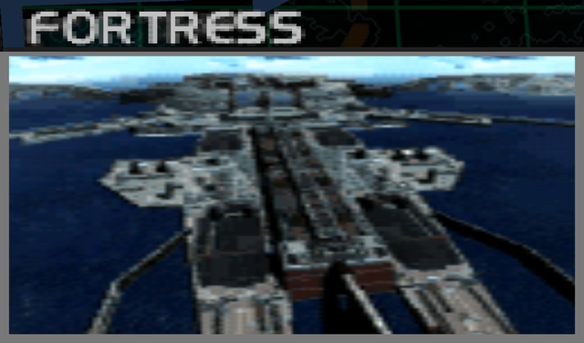
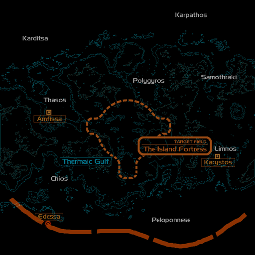
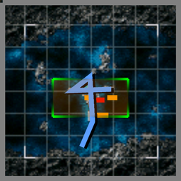

# Mission Data 

<table id="targetList" class="pageLinksTable">
  <tr>
    <td class ="tableImage" colspan="2"></td>
  </tr>
  <tr>
    <td>Location</td>
    <td>Meloss Fort</td>
  </tr>
  <tr>
    <td>Objective</td>
    <td>Destroy all Targets</td>
  </tr>
  <tr>
    <td>Time Limit</td>
    <td>10 Minutes</td>
  </tr>
  <tr>
    <td>Time of Day</td>
    <td>Noon</td>
  </tr>
</table>

# Briefing

  

The Federation capital has been liberated by our ground forces.
The leaders of the People's Federation have moved their operations to the fortified off-shore city of Meloss, and are calling for continued fighting.
We will neutralize this fortress city; you have orders for an all-out assault.
We know very little about this site.
Proceed with caution.

# Mission Map

  

# Enemy List
|Name|Type|Quantity|Score|
|-|-|-|-|
|Hangar|Target - Ground|2|8,000|
|Facility|Target - Ground|2|7,500|
|Tower|Target - Ground|2|7,500|
|Gun Pod|Target - Ground|6|4,500|
|Missile Pod|Target - Ground|6|6,000|
|[S-37 Berkut](/aircraft/28_s-37)|Enemy - Air|2|49,000|
|[Su-37 Flanker](/aircraft/26_su-37)|Enemy - Air|2|52,000|
|[Su-27B Flanker](/aircraft/20_su-27)|Enemy - Air|2|44,000|
|[MiG-29 Fulcrum](/aircraft/11_mig-29)|Enemy - Air|2|48,000|

# Unlock Reward
None

# Mission Guide
Smaller in scale and much easier compared to the previous mission. Gun turrets and missile launchers are placed far apart between each other, and enemy fighters outside the S-37 and Su-37 don't pose too much threat for endgame mission.